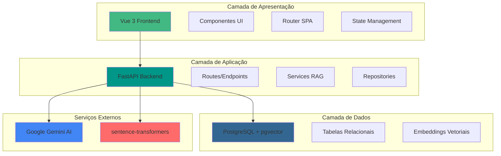

# Arquitetura do Sistema

## Visão Geral

O RAGBot foi projetado com uma arquitetura de três camadas bem definidas, seguindo princípios de separação de responsabilidades e modularidade. A arquitetura permite escalabilidade, manutenibilidade e facilita a adição de novas funcionalidades.

## Stack Tecnológica Completa

| Categoria | Tecnologias |
|-----------|-------------|
| **Frontend** | Vue 3, TypeScript, Vite, Tailwind CSS |
| **Backend** | Python 3.11, FastAPI, Pydantic, LangChain |
| **IA e ML** | Google Gemini 2.5 Flash, sentence-transformers, all-MiniLM-L6-v2 |
| **Banco de Dados** | PostgreSQL 15, pgvector |
| **DevOps** | Docker |
| **Testes** | pytest, Vitest |
| **Qualidade** | Loguru (logging), uvicorn (ASGI server) |

## Decisões de Design e Justificativas

### Modelo de Embeddings: all-MiniLM-L6-v2

**Escolha estratégica para eficiência:**

- **Tamanho compacto**: Apenas 80MB, pode ser armazenado localmente
- **Execução em CPU**: Não requer GPU, reduz custos de infraestrutura
- **Dimensionalidade**: 384 dimensões (balanço entre precisão e performance)
- **Velocidade**: Capaz de processar centenas de chunks em segundos
- **Qualidade**: Excelente desempenho em tarefas de busca semântica

### LLM: Google Gemini AI

**Vantagens do uso de API externa:**

- **Sem custo de infraestrutura**: Não requer servidores de GPU
- **Sem custo monetário**: API gratuita para uso moderado
- **Atualização automática**: Melhorias do modelo sem necessidade de retreinamento
- **Escalabilidade**: Capacidade de processamento gerenciada pelo Google
- **Modelo avançado**: gemini-2.5-flash com suporte a instruções complexas

### Banco Vetorial: pgvector

**Integração nativa com PostgreSQL:**

- **Simplicidade**: Um único banco para dados relacionais e vetoriais
- **Manutenção reduzida**: Sem necessidade de sincronizar múltiplos bancos
- **ACID compliance**: Transações garantem consistência dos dados
- **Performance**: Algoritmos HNSW para busca vetorial eficiente
- **Maturidade**: PostgreSQL é confiável e amplamente conhecido

### Arquitetura Modular

**Benefícios da separação em camadas:**

- **Escalabilidade**: Cada camada pode escalar independentemente
- **Manutenibilidade**: Código organizado facilita alterações
- **Testabilidade**: Camadas podem ser testadas isoladamente
- **Flexibilidade**: Fácil substituir componentes (ex: trocar o LLM)
- **Onboarding**: Desenvolvedores novos navegam o código facilmente

## Características de Performance

### Processamento Eficiente

- **Assíncrono**: FastAPI usa async/await para não bloquear I/O
- **Embedding local**: Geração de embeddings sem latência de rede
- **Busca otimizada**: pgvector usa índices HNSW para busca rápida
- **Caching inteligente**: sentence-transformers carrega modelo uma vez

## Boas Práticas Implementadas

### Código Limpo

- **TypeScript**: Frontend fortemente tipado
- **Naming conventions**: Nomes descritivos e consistentes
- **DRY principle**: Reutilização de código, sem duplicação

### Segurança

- **Validação de entrada**: Pydantic valida todos os dados de entrada
- **CORS configurável**: Proteção contra requisições não autorizadas
- **Sanitização de PDFs**: Validação de formato e tamanho
- **Error handling**: Tratamento adequado de exceções

### Observabilidade

- **Logging estruturado**: Todas as operações são logadas
- **Tempo de processamento**: Métricas de performance registradas
- **Error tracking**: Erros são capturados e contextualizados
- **Request logging**: Requisições HTTP são monitoradas
