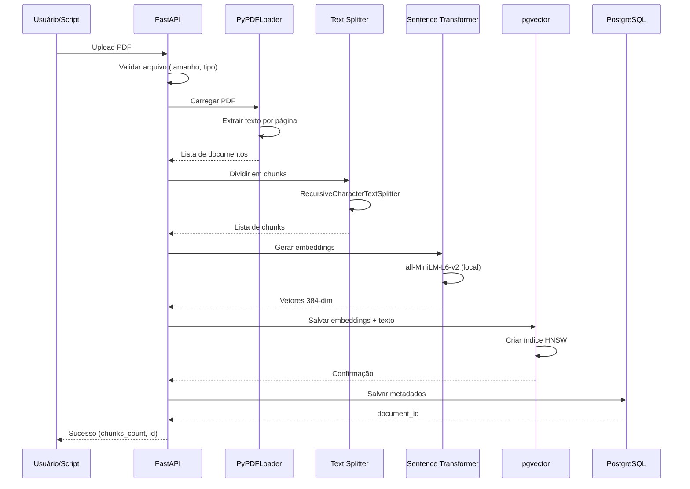
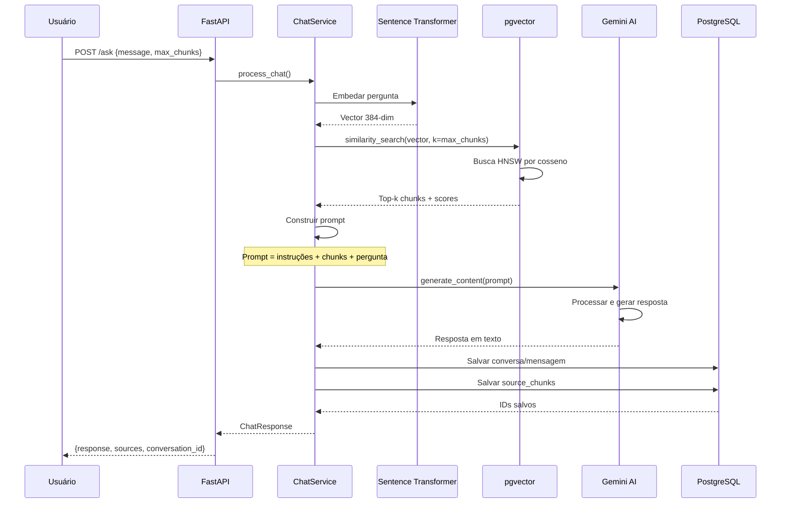

# Pipeline RAG

## O que é RAG?

**RAG (Retrieval-Augmented Generation)** é uma técnica que combina busca de informações com geração de texto por IA. Em vez de depender apenas do conhecimento interno de um modelo de linguagem, o RAG:

1. **Recupera** documentos relevantes de uma base de conhecimento
2. **Aumenta** o prompt com contexto específico
3. **Gera** respostas fundamentadas nos documentos fornecidos

### Por que usar RAG?

**Vantagens sobre LLMs puros:**

- Respostas baseadas em dados específicos e verificáveis
- Não inventa informações (menos "alucinações")
- Conhecimento atualizável sem retreinar modelo
- Citação de fontes para cada resposta
- Controle sobre a base de conhecimento

**Caso de uso do RAGBot:**

- Base: Documentos PDF da UnB (atas, resoluções)
- Objetivo: Responder perguntas apenas com base nesses documentos
- Benefício: Respostas confiáveis e rastreáveis

## Fluxo de Ingestão de Documentos

O processo de adicionar documentos ao sistema envolve várias etapas:



### 1. Upload e Validação

**Endpoint:** `POST /documents/upload`

```python
# Validações realizadas
- Tipo: Apenas PDFs
- Tamanho: Máximo 50MB
- Nome: Não duplicado
```

### 2. Extração de Texto

**Biblioteca:** LangChain PyPDFLoader

```python
loader = PyPDFLoader(pdf_path)
documents = loader.load()
# Cada página vira um Document com metadados
```

**Metadados preservados:**

- Nome do arquivo
- Número da página
- Outros metadados do PDF

### 3. Chunking (Divisão em Pedaços)

**Estratégia:** RecursiveCharacterTextSplitter

```python
text_splitter = RecursiveCharacterTextSplitter(
    chunk_size=1000,      # Máximo de 1000 caracteres
    chunk_overlap=150     # 150 caracteres de overlap
)
chunks = text_splitter.split_documents(documents)
```

**Por que dividir?**

- LLMs têm limite de contexto
- Chunks menores = busca mais precisa
- Overlap evita perda de contexto nas bordas

**Exemplo de chunking:**
```
Documento: "Lorem ipsum dolor sit amet..."

Chunk 1: [0-1000]   "Lorem ipsum dolor..."
Chunk 2: [850-1850] "...sit amet consectetur..." (overlap de 150)
Chunk 3: [1700-2700] "...adipiscing elit sed..."
```

### 4. Geração de Embeddings

**Modelo:** sentence-transformers/all-MiniLM-L6-v2

```python
embeddings_model = SentenceTransformer('all-MiniLM-L6-v2')
vectors = embeddings_model.encode(chunks)
# Output: Array de vetores 384-dimensionais
```

**Características do modelo:**

- Leve: 80MB
- Rápido: ~50 chunks/segundo em CPU
- Eficiente: 384 dimensões (vs 768 ou 1536)
- Multilíngue: Suporta português

### 5. Armazenamento Vetorial

**LangChain + pgvector:**

```python
vector_store = PGVector(
    embeddings=embeddings_model,
    connection=database_url,
    collection_name="ragbot_chunks",
    distance_strategy=DistanceStrategy.COSINE
)

vector_store.add_documents(chunks)
```

**O que acontece internamente:**

- Chunks são inseridos em `langchain_pg_embedding`
- Índice HNSW é atualizado automaticamente
- Metadados são salvos como JSONB

### 6. Metadados do Documento

**Salvo em `documents`:**

```python
doc_id = document_repository.save_document_metadata(
    filename="ata_reuniao_2024.pdf",
    chunks_count=45,
    file_size_bytes=2048576
)
```

## Fluxo de Busca e Resposta

Quando o usuário faz uma pergunta, o sistema executa:



### 1. Recepção da Pergunta

**Endpoint:** `POST /ask`

```python
{
  "message": "Quais foram as decisões da reunião de março?",
  "max_chunks": 5,
  "conversation_id": null  // opcional
}
```

### 2. Embedding da Pergunta

```python
query_vector = embeddings_model.encode(user_message)
# Mesmo modelo usado na ingestão
```

**Importante:** Mesmo modelo para query e documentos garante consistência semântica.

### 3. Busca por Similaridade

```python
results = vector_store.similarity_search_with_score(
    query=user_message,
    k=max_chunks
)

# Retorna: [(document, score), ...]
# score = 1 - cosine_distance (0-1, maior é melhor)
```

**Algoritmo de busca:**

1. pgvector calcula distância cosseno entre query e todos embeddings
2. HNSW navega grafo para encontrar vizinhos mais próximos
3. Retorna top-k chunks com maior similaridade

**Exemplo de resultado:**
```python
[
  {
    'content': 'Na reunião de março foi decidido...',
    'document_name': 'ata_marco_2024.pdf',
    'similarity_score': 0.87
  },
  {
    'content': 'O conselho aprovou a proposta de...',
    'document_name': 'ata_marco_2024.pdf',
    'similarity_score': 0.82
  }
]
```

### 4. Construção do Prompt

```python
def _build_prompt(user_question, relevant_chunks):
    context = "\n\n".join([
        f"Documento: {chunk['document_name']}\n"
        f"Conteúdo: {chunk['content']}"
        for chunk in relevant_chunks
    ])
    
    prompt = f"""
    Você é um assistente especializado em responder perguntas 
    baseadas exclusivamente no conteúdo dos documentos fornecidos.

    INSTRUÇÕES:
    1. Responda APENAS com base nos documentos fornecidos
    2. Se não houver informação suficiente, diga claramente
    3. Cite sempre os documentos utilizados
    4. Seja preciso e objetivo

    CONTEXTO DOS DOCUMENTOS:
    {context}

    PERGUNTA DO USUÁRIO:
    {user_question}

    RESPOSTA:
    """
    return prompt
```

**Componentes do prompt:**

- **System instructions**: Diretrizes de comportamento
- **Context**: Chunks relevantes recuperados
- **Query**: Pergunta do usuário

### 5. Geração com Gemini

```python
model = genai.GenerativeModel('gemini-2.5-flash')
response = model.generate_content(prompt)
answer = response.text
```

**Parâmetros do Gemini:**

- Modelo: gemini-2.5-flash (rápido e eficiente)
- Temperature: Padrão (balanceado)
- Max tokens: Automático

### 6. Persistência da Resposta

```python
# Salvar conversa (se nova)
conversation_id = create_conversation()

# Salvar mensagem do usuário
user_msg_id = save_message(
    conversation_id, 
    role='user', 
    content=user_message
)

# Salvar resposta do assistente
assistant_msg_id = save_message(
    conversation_id,
    role='assistant',
    content=answer
)

# Salvar chunks usados como fonte
for chunk in relevant_chunks:
    save_source_chunk(
        message_id=assistant_msg_id,
        chunk_content=chunk['content'],
        document_name=chunk['document_name'],
        similarity_score=chunk['similarity_score']
    )
```

### 7. Retorno ao Usuário

```python
{
  "response": "Na reunião de março de 2024 foram decididos...",
  "conversation_id": "123e4567-e89b-12d3-a456-426614174000",
  "message_id": "789e4567-e89b-12d3-a456-426614174001",
  "sources": [
    {
      "content": "Na reunião de março foi decidido...",
      "document_name": "ata_marco_2024.pdf",
      "similarity_score": 0.87
    }
  ],
  "processing_time": 2.34
}
```

## Parâmetros Configuráveis

### Chunking

```python
CHUNK_SIZE = 1000        # Tamanho do chunk em caracteres
CHUNK_OVERLAP = 150      # Overlap entre chunks
```

**Trade-offs:**

- **Chunks maiores**: Mais contexto, menos precisão na busca
- **Chunks menores**: Mais precisão, risco de perder contexto
- **Overlap maior**: Mais redundância, evita perda de informação

### Busca

```python
max_chunks = 5  # Quantidade de chunks a recuperar (1-10)
```

**Trade-offs:**

- **Mais chunks**: Mais contexto, resposta mais completa, mais lento
- **Menos chunks**: Mais rápido, resposta mais focada, risco de perder info

### Modelo de Embeddings

```python
EMBEDDING_MODEL_NAME = "all-MiniLM-L6-v2"
```

**Alternativas possíveis:**

- `all-mpnet-base-v2`: Mais preciso, 420MB, 768 dims
- `paraphrase-multilingual-MiniLM-L12-v2`: Melhor para PT-BR

## Otimizações Implementadas

### Cache do Modelo

Modelo carregado uma vez na inicialização:

```python
class ChatService:
    def __init__(self):
        self.model = SentenceTransformer(EMBEDDING_MODEL_NAME)
        # Reutilizado para todas as requisições
```

### Busca Assíncrona

FastAPI permite operações não bloqueantes:

```python
async def process_chat(...):
    # Não bloqueia outras requisições
    chunks = await vector_store.similarity_search(...)
```

### Índices HNSW

pgvector cria índices otimizados automaticamente:

- Busca aproximada em tempo logarítmico
- Performance consistente mesmo com milhões de vetores

### Truncamento de Fontes

Chunks retornados ao frontend são truncados:

```python
SourceChunk(
    content=chunk['content'][:200] + "..."  # Primeiros 200 chars
)
```

**Benefício:** Reduz payload HTTP sem perder informação essencial.

## Medição de Performance

### Ingestão

| PDF | Páginas | Chunks | Tempo |
|-----|---------|--------|-------|
| Pequeno | 5 | 15 | ~3s |
| Médio | 20 | 60 | ~10s |
| Grande | 50 | 150 | ~25s |


### Respostas

| PDF | Páginas | Chunks | Tempo |
|-----|---------|--------|-------|
| Pequeno | 5 | 15 | ~3s |
| Médio | 20 | 60 | ~10s |
| Grande | 50 | 150 | ~25s |

## Tratamento de Casos Especiais

### Sem Documentos Relevantes

```python
if not relevant_chunks:
    response_text = (
        "Desculpe, não encontrei informações relevantes "
        "nos documentos disponíveis para responder sua pergunta."
    )
    source_chunks = []
```

### Múltiplas Fontes

Sistema automaticamente cita todos os documentos usados:

```python
sources = [
  {"document_name": "ata_2024_01.pdf", "score": 0.89},
  {"document_name": "ata_2024_03.pdf", "score": 0.84}
]
```

### Respostas Longas

Gemini pode gerar respostas extensas se necessário, mas é instruído a ser objetivo.

## Qualidade das Respostas

### Estratégias de Prompt

**Instruções claras:**

- Responder apenas com base nos documentos
- Citar fontes
- Admitir quando não sabe

**Exemplo de resposta ideal:**

> "Segundo a ata da reunião de março de 2024, foram aprovadas três propostas: [lista]. Esta informação consta no documento ata_marco_2024.pdf."

### Validação

Sistema valida se chunks recuperados são realmente relevantes através do similarity score mínimo (implícito no top-k).
