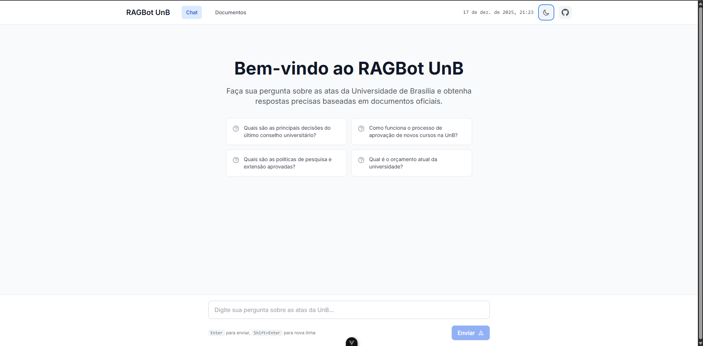
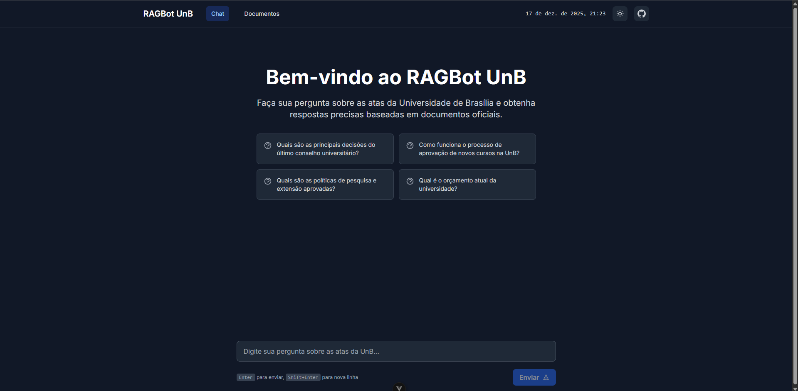
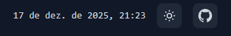

# Interface e Experiência do Usuário

## Design da Interface

A interface do RAGBot foi desenvolvida com foco em **simplicidade, clareza e usabilidade**, proporcionando uma experiência agradável para consultar documentos através de chat.

### Princípios de Design

**Minimalismo:**

- Interface limpa sem elementos desnecessários
- Foco no conteúdo (chat e documentos)
- Hierarquia visual clara

**Consistência:**

- Padrões visuais mantidos em todas as telas
- Componentes reutilizáveis
- Comportamento previsível

**Acessibilidade:**

- Contraste adequado entre texto e fundo
- Tamanhos de botão apropriados para toque
- Feedback visual para todas as ações

## Tema Claro e Escuro

Uma das principais funcionalidades de UX é o **suporte a temas**, permitindo que usuários escolham sua preferência visual.

### Modo Claro

**Características:**

- Fundo branco (#FFFFFF)
- Texto escuro (#111827)
- Ideal para ambientes bem iluminados
- Menor cansaço visual durante o dia



### Modo Escuro

**Características:**

- Fundo escuro (#111827)
- Texto claro (#F9FAFB)
- Reduz fadiga ocular em ambientes escuros
- Economiza bateria em telas OLED



### Alternância de Tema

**Implementação:**

```typescript
// Toggle entre temas
const toggleTheme = () => {
  isDark.value = !isDark.value
  document.documentElement.classList.toggle('dark')
  localStorage.setItem('theme', isDark.value ? 'dark' : 'light')
}
```

**Persistência:**

- Preferência salva no localStorage
- Tema restaurado ao reabrir aplicação
- Respeita preferência do sistema operacional

**Botão de alternância:**

- Ícone de sol/lua
- Localizado no header (fácil acesso)
- Feedback visual ao clicar
- Transição suave entre temas



## Feedback Visual

O sistema fornece **feedback constante** ao usuário sobre o estado das operações:

### Estados de Carregamento

**Typing Indicator:**

```vue
<div class="typing-indicator">
  <span></span>
  <span></span>
  <span></span>
</div>
```

- Exibido enquanto IA está processando
- Animação de "três pontos pulsantes"
- Indica que sistema está trabalhando

**Loading Spinner:**

- Mostrado durante upload de documentos
- Indica processamento em andamento
- Evita múltiplos cliques

### Feedback de Ações

**Envio de Mensagem:**

- Mensagem aparece imediatamente no chat
- Scroll automático para última mensagem
- Campo de input limpo após envio

**Upload de Documento:**

- Barra de progresso (se implementada)
- Mensagem de sucesso ao completar
- Erro claro se falhar

**Navegação:**

- Highlight da página atual no menu
- Transições suaves entre rotas
- Breadcrumbs quando aplicável

### Estados de Erro

**Mensagens de Erro:**

- Texto claro e objetivo
- Cor vermelha para chamar atenção
- Sugestão de ação quando possível

**Exemplos:**

```
❌ Erro ao carregar documentos. Tente novamente.
❌ Documento muito grande. Máximo: 50MB.
❌ Erro ao conectar com o servidor.
```

## Design Responsivo

A interface se adapta a **diferentes tamanhos de tela**, proporcionando boa experiência em todos os dispositivos.

### Breakpoints

**Mobile (< 768px):**

- Menu hamburguer
- Chat ocupa tela inteira
- Botões maiores para toque

**Tablet (768px - 1024px):**

- Layout adaptado
- Sidebar pode ser colapsável
- Orientação portrait/landscape

**Desktop (> 1024px):**

- Menu sempre visível
- Layout aproveitando largura
- Hover states em elementos

### Mobile-First

**Abordagem:**

```css
/* Estilos base (mobile) */
.chat-input { padding: 1rem; }

/* Ajustes para desktop */
@media (min-width: 768px) {
  .chat-input { padding: 1.5rem; }
}
```

**Vantagens:**

- Performance otimizada para mobile
- Progressive enhancement
- Código mais limpo

## Componentes de Interface

### Header

**Elementos:**

- Logo/nome do sistema
- Menu de navegação
- Toggle de tema
- Timestamp (desktop)

**Comportamento:**

- Sticky (fixo no topo)
- Transição suave ao rolar
- Responsivo (hamburger em mobile)

## Animações e Transições

**Transições Suaves:**

```css
.chat-bubble {
  transition: all 0.3s ease-in-out;
}

.fade-enter-active, .fade-leave-active {
  transition: opacity 0.3s;
}
```

**Animações:**

- Fade in ao aparecer mensagens
- Slide up para modals
- Pulse no typing indicator
- Smooth scroll no chat

**Performance:**

- Transições apenas em propriedades GPU (transform, opacity)
- Evita reflow/repaint desnecessários
- Animações desabilitadas se usuário preferir (prefers-reduced-motion)

## Qualidade Visual

**Tipografia:**

- Fonte Inter (legível e moderna)
- Line-height adequado (1.5-1.6)
- Tamanhos hierárquicos (16-18-24-32px)

**Iconografia:**

- Icons SVG inline
- Tamanho consistente (20-24px)
- Cor adaptável ao tema

**Sombras e Elevação:**

- Box-shadow sutil para cards
- Elevação indica interatividade
- Modo escuro com sombras mais escuras

Essa atenção aos detalhes de interface e experiência do usuário resulta em um sistema agradável de usar, intuitivo e acessível, mesmo sem uma fase formal de design antes do desenvolvimento.
