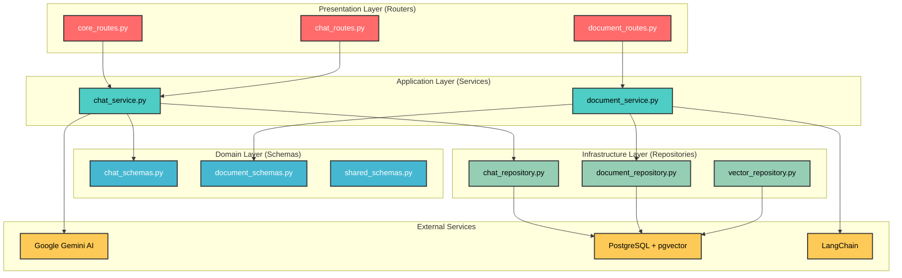

# Backend - FastAPI Application

## 🚀 Visão Geral

O backend do RAGBot é uma **aplicação FastAPI moderna** que implementa um sistema completo de **Retrieval-Augmented Generation (RAG)**. A arquitetura segue princípios de **Clean Architecture** e **SOLID**, proporcionando alta maintibilidade, testabilidade e escalabilidade.

### 🎯 Responsabilidades Principais

- 🔌 **API RESTful** para comunicação com frontend
- 📄 **Processamento de documentos** PDF
- 🧮 **Geração de embeddings** vetoriais
- 🔍 **Busca semântica** em documentos
- 🤖 **Integração com IA** (Google Gemini)
- 💾 **Persistência de dados** (PostgreSQL + pgvector)
- 📊 **Monitoramento e logs** estruturados

---

## 🏗️ Arquitetura do Backend

### Clean Architecture Implementation



### 📁 Estrutura Detalhada

```
app/
├── __init__.py                 # Inicialização do módulo
├── main.py                     # Entry point da aplicação
├── application.py              # Configuração FastAPI + middleware
│
├── config/                     # Configurações e constantes
│   ├── __init__.py
│   ├── settings.py            # Variáveis de ambiente com Pydantic
│   └── constants.py           # Constantes da aplicação
│
├── routes/                     # Camada de Apresentação (Endpoints)
│   ├── __init__.py
│   ├── core_routes.py         # Health check e informações básicas
│   ├── chat_routes.py         # Endpoints de conversação
│   └── document_routes.py     # Endpoints de gerenciamento de documentos
│
├── schemas/                    # Modelos Pydantic (Validação)
│   ├── __init__.py
│   ├── chat_schemas.py        # DTOs para chat e conversação
│   ├── document_schemas.py    # DTOs para documentos
│   └── shared_schemas.py      # DTOs compartilhados
│
├── services/                   # Camada de Aplicação (Lógica de Negócio)
│   ├── __init__.py
│   ├── chat_service.py        # Orquestração do fluxo RAG
│   └── document_service.py    # Processamento de documentos
│
└── repositories/              # Camada de Infraestrutura (Dados)
    ├── __init__.py
    ├── chat_repository.py     # Persistência de conversas/mensagens
    ├── document_repository.py # Persistência de documentos
    └── vector_repository.py   # Operações vetoriais com LangChain
```

---

## ⚙️ Configuração e Inicialização

### main.py - Entry Point

```python
# app/main.py
from .application import create_app
from .config.constants import DEFAULT_HOST, DEFAULT_PORT
from .config.settings import settings
import uvicorn

app = create_app()

if __name__ == "__main__":
    uvicorn.run(
        "app.main:app",
        host=DEFAULT_HOST,
        port=DEFAULT_PORT,
        reload=settings.debug,
        log_level=settings.log_level.lower(),
        timeout_keep_alive=60,
        timeout_graceful_shutdown=30
    )
```

### application.py - FastAPI Configuration

```python
# app/application.py
from contextlib import asynccontextmanager
from fastapi import FastAPI, Request
from fastapi.middleware.cors import CORSMiddleware
from fastapi.responses import JSONResponse
from loguru import logger

from .config.settings import settings
from .config.constants import APP_NAME, APP_VERSION
from db.manager import db_manager

from .routes.core_routes import router as core_router
from .routes.chat_routes import router as chat_router  
from .routes.document_routes import router as document_router

@asynccontextmanager
async def lifespan(app: FastAPI):
    """Application lifecycle management"""
    logger.info(f"Iniciando {APP_NAME} v{APP_VERSION}")
    
    # Database connection test
    if not db_manager.test_connection():
        logger.error("Falha ao conectar com o banco de dados!")
        raise RuntimeError("Conexão com o banco de dados falhou")
    
    logger.info("Aplicação iniciada com sucesso")
    yield
    logger.info("Finalizando aplicação RAGBot...")

def create_app() -> FastAPI:
    """Create and configure FastAPI application"""
    
    app = FastAPI(
        title=APP_NAME,
        description="Sistema inteligente de chat com RAG para consulta de documentos",
        version=APP_VERSION,
        docs_url="/docs" if settings.debug else None,
        redoc_url="/redoc" if settings.debug else None,
        lifespan=lifespan
    )
    
    # CORS middleware
    app.add_middleware(
        CORSMiddleware,
        allow_origins=settings.allowed_origins,
        allow_credentials=True,
        allow_methods=["GET", "POST", "DELETE"],
        allow_headers=["*"],
    )
    
    # Request logging middleware
    @app.middleware("http")
    async def log_requests(request: Request, call_next):
        start_time = time.time()
        response = await call_next(request)
        process_time = time.time() - start_time
        
        logger.info(
            f"{request.method} {request.url.path} - "
            f"Status: {response.status_code} - "
            f"Tempo: {process_time:.4f}s"
        )
        return response
    
    # Error handlers
    @app.exception_handler(404)
    async def not_found_handler(request: Request, exc):
        return JSONResponse(
            status_code=404,
            content={
                "error": "Endpoint não encontrado",
                "detail": f"O endpoint {request.url.path} não existe"
            }
        )
    
    @app.exception_handler(500)
    async def internal_error_handler(request: Request, exc):
        logger.error(f"Erro interno do servidor: {exc}")
        return JSONResponse(
            status_code=500,
            content={
                "error": "Erro interno do servidor",
                "detail": "Ocorreu um erro inesperado"
            }
        )
    
    # Include routers
    app.include_router(core_router, tags=["Core"])
    app.include_router(chat_router, prefix="/api", tags=["Chat"])
    app.include_router(document_router, prefix="/api/documents", tags=["Documents"])
    
    return app
```

### settings.py - Configuration Management

```python
# app/config/settings.py
from pydantic import Field
from pydantic_settings import BaseSettings, SettingsConfigDict
from typing import List

class Settings(BaseSettings):
    """Application configuration with environment variables"""
    
    model_config = SettingsConfigDict(
        env_file=".env",
        env_file_encoding="utf-8",
        extra="ignore"
    )
    
    # Application
    debug: bool = Field(default=False, description="Debug mode")
    log_level: str = Field(default="INFO", description="Log level")
    host: str = Field(default="0.0.0.0", description="Host to bind")
    port: int = Field(default=8000, description="Port to bind")
    
    # Database
    database_url: str = Field(..., description="PostgreSQL connection URL")
    database_pool_size: int = Field(default=20, description="Connection pool size")
    database_max_overflow: int = Field(default=0, description="Max pool overflow")
    
    # AI Configuration  
    gemini_api_key: str = Field(..., description="Google Gemini AI API Key")
    
    # CORS
    allowed_origins: List[str] = Field(
        default=["http://localhost:5173", "http://localhost:3000"],
        description="Allowed CORS origins"
    )
    
    # File Upload
    max_file_size_mb: int = Field(default=50, description="Max file size in MB")
    upload_folder: str = Field(default="./documents", description="Upload folder")
    
    # RAG Configuration
    chunk_size: int = Field(default=1000, description="Text chunk size")
    chunk_overlap: int = Field(default=200, description="Text chunk overlap")
    max_chunks_per_query: int = Field(default=10, description="Max chunks per query")
    similarity_threshold: float = Field(default=0.7, description="Similarity threshold")
    
    # Embedding Model
    embedding_model: str = Field(
        default="sentence-transformers/all-MiniLM-L6-v2",
        description="Embedding model name"
    )
    embedding_dimension: int = Field(default=384, description="Embedding dimension")

# Global settings instance
settings = Settings()
```

---

## 💬 Chat Service - Coração do RAG

### ChatService Implementation

```python
# app/services/chat_service.py
import time
import uuid
from typing import List, Dict, Any, Optional
import google.generativeai as genai
from loguru import logger

from ..config.settings import settings
from ..repositories.chat_repository import ChatRepository
from ..repositories.vector_repository import get_vector_store
from ..schemas.chat_schemas import ChatResponse
from ..schemas.shared_schemas import SourceChunk

class ChatService:
    """Service responsible for RAG chat processing"""
    
    def __init__(self):
        # Initialize Google Gemini AI
        genai.configure(api_key=settings.gemini_api_key)
        self.model = genai.GenerativeModel('gemini-2.0-flash-exp')
        
        # Initialize repositories
        self.vector_store = get_vector_store()
        self.chat_repository = ChatRepository()
        
        logger.info("Chat service initialized with Gemini and LangChain")
    
    def _build_prompt(self, user_question: str, relevant_chunks: List[Dict[str, Any]]) -> str:
        """Build contextualized prompt for AI model"""
        
        # Format context from retrieved chunks
        context = "\n\n".join([
            f"Documento: {chunk['document_name']}\nConteúdo: {chunk['content']}"
            for chunk in relevant_chunks
        ])
        
        # System prompt with clear instructions
        prompt = f"""Você é um assistente especializado em responder perguntas baseadas exclusivamente no conteúdo dos documentos fornecidos.

INSTRUÇÕES IMPORTANTES:
1. Responda APENAS com base no conteúdo dos documentos fornecidos abaixo
2. Se a pergunta não puder ser respondida com base nos documentos, diga claramente que não há informações suficientes
3. Cite sempre os documentos utilizados na resposta quando relevante
4. Seja preciso, objetivo e direto
5. Use formatação markdown para melhor legibilidade

CONTEXTO DOS DOCUMENTOS:
{context}

PERGUNTA DO USUÁRIO:
{user_question}

RESPOSTA:"""
        
        return prompt
    
    async def process_chat(
        self, 
        user_message: str, 
        max_chunks: int, 
        conversation_id: Optional[uuid.UUID] = None
    ) -> ChatResponse:
        """Process chat message through complete RAG pipeline"""
        
        start_time = time.time()
        
        try:
            # Create conversation if not provided
            if not conversation_id:
                conversation_id = self.chat_repository.create_conversation()
                logger.info(f"Created new conversation: {conversation_id}")
            
            # Step 1: Retrieve relevant chunks using semantic search
            logger.info(f"Searching for relevant chunks (max: {max_chunks})")
            relevant_chunks = self.vector_store.similarity_search_with_score(
                user_message, 
                k=max_chunks
            )
            
            if not relevant_chunks:
                logger.warning("No relevant chunks found for query")
                response_text = "Desculpe, não encontrei informações relevantes nos documentos disponíveis para responder sua pergunta."
                source_chunks = []
            else:
                logger.info(f"Found {len(relevant_chunks)} relevant chunks")
                
                # Step 2: Build contextualized prompt
                prompt = self._build_prompt(user_message, relevant_chunks)
                
                # Step 3: Generate response with Gemini AI
                logger.info("Generating response with Gemini AI")
                response = self.model.generate_content(prompt)
                response_text = response.text
                
                # Step 4: Prepare source chunks for response
                source_chunks = [
                    SourceChunk(
                        content=chunk['content'][:200] + "..." if len(chunk['content']) > 200 else chunk['content'],
                        document_name=chunk['document_name'],
                        page_number=chunk.get('page_number'),
                        similarity_score=chunk['similarity_score']
                    )
                    for chunk in relevant_chunks
                ]
            
            # Step 5: Persist conversation in database
            message_id = self.chat_repository.create_message(
                conversation_id=conversation_id,
                user_message=user_message,
                assistant_response=response_text,
                source_chunks=[]  # Simplified for now
            )
            
            processing_time = time.time() - start_time
            
            logger.success(f"Chat processed successfully in {processing_time:.2f}s")
            
            return ChatResponse(
                response=response_text,
                conversation_id=conversation_id,
                message_id=message_id,
                sources=source_chunks,
                processing_time=processing_time
            )
            
        except Exception as e:
            logger.error(f"Error processing chat: {e}")
            raise

# Global service instance
chat_service = ChatService()
```

### Chat Routes

```python
# app/routes/chat_routes.py
from fastapi import APIRouter, HTTPException, status
from loguru import logger

from ..schemas.chat_schemas import ChatRequest, ChatResponse
from ..services.chat_service import chat_service

router = APIRouter()

@router.post("/chat", response_model=ChatResponse)
async def chat_endpoint(request: ChatRequest):
    """
    Process chat message and return AI-generated response
    
    This endpoint implements the complete RAG pipeline:
    1. Semantic search for relevant document chunks
    2. Context building with retrieved information
    3. AI response generation using Google Gemini
    4. Conversation persistence in database
    """
    try:
        logger.info(f"Processing chat request: {request.message[:100]}...")
        
        response = await chat_service.process_chat(
            user_message=request.message,
            max_chunks=request.max_chunks,
            conversation_id=request.conversation_id
        )
        
        logger.info(f"Chat response generated successfully in {response.processing_time:.4f}s")
        return response
        
    except Exception as e:
        logger.error(f"Error in chat endpoint: {e}")
        raise HTTPException(
            status_code=status.HTTP_500_INTERNAL_SERVER_ERROR,
            detail=f"Erro ao processar chat: {str(e)}"
        )

@router.get("/conversations/{conversation_id}/messages")
async def get_conversation_messages(conversation_id: uuid.UUID):
    """Get conversation message history (Future implementation)"""
    return {
        "conversation_id": conversation_id,
        "messages": [],
        "message": "Endpoint em desenvolvimento"
    }
```

---

## 📄 Document Service - Processamento de PDFs

### DocumentService Implementation

```python
# app/services/document_service.py
import time
import uuid
from loguru import logger
import tempfile
import os
from langchain_community.document_loaders import PyPDFLoader
from langchain.text_splitter import RecursiveCharacterTextSplitter

from ..config.constants import MAX_FILE_SIZE_MB, CHUNK_SIZE, CHUNK_OVERLAP
from ..repositories.vector_repository import get_vector_store
from ..repositories.document_repository import document_repository
from ..schemas.document_schemas import DocumentUploadResponse, DocumentListResponse

class DocumentService:
    """Service responsible for document processing and management"""
    
    def __init__(self):
        self.vector_store = get_vector_store()
        self.text_splitter = RecursiveCharacterTextSplitter(
            chunk_size=CHUNK_SIZE,
            chunk_overlap=CHUNK_OVERLAP,
            separators=["\n\n", "\n", ". ", " ", ""]
        )
        logger.info("Document service initialized")
    
    def _validate_file(self, content: bytes, filename: str) -> None:
        """Validate uploaded file constraints"""
        
        # File type validation
        if not filename.lower().endswith('.pdf'):
            raise ValueError("Apenas arquivos PDF são suportados")
        
        # File size validation
        max_size_bytes = MAX_FILE_SIZE_MB * 1024 * 1024
        if len(content) > max_size_bytes:
            raise ValueError(f"Arquivo muito grande. Máximo: {MAX_FILE_SIZE_MB}MB")
        
        # Empty file validation
        if len(content) == 0:
            raise ValueError("Arquivo está vazio")
        
        # Duplicate file validation
        if document_repository.document_exists(filename):
            raise ValueError(f"Documento '{filename}' já foi processado anteriormente")
        
        logger.info(f"File validation passed: {filename} ({len(content)} bytes)")
    
    def _process_pdf_to_chunks(self, content: bytes, filename: str) -> list:
        """Extract text from PDF and split into manageable chunks"""
        
        logger.info(f"Starting PDF processing: {filename}")
        temp_file_path = None
        
        try:
            # Create temporary file for LangChain processing
            with tempfile.NamedTemporaryFile(suffix='.pdf', delete=False) as temp_file:
                temp_file.write(content)
                temp_file_path = temp_file.name
            
            # Load PDF using LangChain
            loader = PyPDFLoader(temp_file_path)
            documents = loader.load()
            
            logger.info(f"PDF loaded successfully: {len(documents)} pages found")
            
            if not documents:
                raise ValueError("Não foi possível extrair texto do PDF")
            
            # Split documents into chunks
            chunks = self.text_splitter.split_documents(documents)
            
            if not chunks:
                raise ValueError("Não foi possível criar chunks do documento")
            
            logger.info(f"Document split into {len(chunks)} chunks")
            
            # Add metadata to chunks
            for i, chunk in enumerate(chunks):
                chunk.metadata.update({
                    'document_name': filename,
                    'chunk_index': i,
                    'total_chunks': len(chunks),
                    'processed_at': time.time()
                })
            
            return chunks
            
        except Exception as e:
            logger.error(f"Error processing PDF: {e}")
            raise ValueError(f"Erro ao processar PDF: {str(e)}")
        
        finally:
            # Cleanup temporary file
            if temp_file_path and os.path.exists(temp_file_path):
                os.unlink(temp_file_path)
    
    async def process_document_upload(self, content: bytes, filename: str) -> DocumentUploadResponse:
        """Complete document upload and processing pipeline"""
        
        start_time = time.time()
        
        try:
            # Step 1: Validate file
            self._validate_file(content, filename)
            
            # Step 2: Extract and chunk text
            chunks = self._process_pdf_to_chunks(content, filename)
            
            # Step 3: Generate embeddings and store in vector database
            logger.info(f"Adding {len(chunks)} chunks to vector store")
            
            # LangChain handles embedding generation automatically
            document_ids = self.vector_store.add_documents(chunks)
            
            # Step 4: Store document metadata in PostgreSQL
            document_id = document_repository.create_document(
                filename=filename,
                content_type="application/pdf",
                file_size=len(content),
                chunk_count=len(chunks)
            )
            
            processing_time = time.time() - start_time
            
            logger.success(
                f"Document processing completed: {filename} "
                f"({len(chunks)} chunks, {processing_time:.2f}s)"
            )
            
            return DocumentUploadResponse(
                status="success",
                message="Documento processado com sucesso",
                document_id=document_id,
                filename=filename,
                chunks_created=len(chunks),
                processing_time=processing_time,
                file_size=len(content)
            )
            
        except ValueError as e:
            # Business logic errors
            return DocumentUploadResponse(
                status=f"error: {str(e)}",
                message="Erro na validação ou processamento",
                document_id=None,
                filename=filename,
                chunks_created=0,
                processing_time=time.time() - start_time,
                file_size=len(content)
            )
        
        except Exception as e:
            logger.error(f"Unexpected error in document processing: {e}")
            raise
    
    def list_documents(self) -> DocumentListResponse:
        """List all processed documents with metadata"""
        try:
            documents = document_repository.get_all_documents()
            
            return DocumentListResponse(
                documents=documents,
                total_documents=len(documents),
                total_file_size=sum(doc.file_size for doc in documents)
            )
            
        except Exception as e:
            logger.error(f"Error listing documents: {e}")
            raise
    
    def delete_document(self, document_id: uuid.UUID) -> DocumentDeleteResponse:
        """Delete document and all associated chunks"""
        try:
            # Get document info before deletion
            document = document_repository.get_document_by_id(document_id)
            if not document:
                raise ValueError("Documento não encontrado")
            
            # Delete from vector store (implementation depends on store type)
            # self.vector_store.delete_by_document_id(document_id)
            
            # Delete from PostgreSQL
            deleted_chunks = document_repository.delete_document(document_id)
            
            logger.info(f"Document deleted: {document.filename} ({deleted_chunks} chunks)")
            
            return DocumentDeleteResponse(
                status="success",
                message="Documento excluído com sucesso",
                filename=document.filename,
                chunks_deleted=deleted_chunks
            )
            
        except ValueError:
            raise
        except Exception as e:
            logger.error(f"Error deleting document: {e}")
            raise

# Global service instance
document_service = DocumentService()
```

---

## 🗄️ Repository Layer - Data Access

### Vector Repository - LangChain Integration

```python
# app/repositories/vector_repository.py
from langchain_postgres import PGVector
from langchain_community.embeddings import SentenceTransformerEmbeddings
from typing import List, Dict, Any

from ..config.settings import settings

class VectorRepository:
    """Repository for vector operations using LangChain + pgvector"""
    
    def __init__(self):
        # Initialize embedding model
        self.embeddings = SentenceTransformerEmbeddings(
            model_name=settings.embedding_model,
            model_kwargs={'device': 'cpu'},
            encode_kwargs={'normalize_embeddings': True}
        )
        
        # Initialize PGVector store
        self.vector_store = PGVector(
            collection_name="ragbot_chunks",
            connection_string=settings.database_url,
            embedding_function=self.embeddings
        )
    
    def similarity_search_with_score(self, query: str, k: int = 5) -> List[Dict[str, Any]]:
        """Perform semantic similarity search"""
        
        # Use LangChain's built-in similarity search
        results = self.vector_store.similarity_search_with_score(
            query=query,
            k=k
        )
        
        # Format results for service layer
        formatted_results = []
        for doc, score in results:
            formatted_results.append({
                'content': doc.page_content,
                'document_name': doc.metadata.get('document_name', 'Unknown'),
                'page_number': doc.metadata.get('page', 1),
                'chunk_index': doc.metadata.get('chunk_index', 0),
                'similarity_score': float(score)
            })
        
        return formatted_results
    
    def add_documents(self, documents: List) -> List[str]:
        """Add documents to vector store"""
        return self.vector_store.add_documents(documents)

# Global vector store instance
_vector_store = None

def get_vector_store():
    """Get singleton vector store instance"""
    global _vector_store
    if _vector_store is None:
        _vector_store = VectorRepository()
    return _vector_store.vector_store
```

### Chat Repository - Conversation Persistence

```python
# app/repositories/chat_repository.py
import uuid
from typing import List, Optional
from sqlalchemy.orm import Session
from loguru import logger

from db.manager import db_manager

class ChatRepository:
    """Repository for chat and conversation data persistence"""
    
    def create_conversation(self) -> uuid.UUID:
        """Create new conversation and return ID"""
        try:
            conversation_id = uuid.uuid4()
            
            with db_manager.get_session() as session:
                session.execute(
                    """
                    INSERT INTO conversations (id, title, created_at, updated_at)
                    VALUES (%s, %s, NOW(), NOW())
                    """,
                    (conversation_id, "Nova Conversa")
                )
                session.commit()
            
            logger.info(f"Created conversation: {conversation_id}")
            return conversation_id
            
        except Exception as e:
            logger.error(f"Error creating conversation: {e}")
            raise
    
    def create_message(
        self,
        conversation_id: uuid.UUID,
        user_message: str,
        assistant_response: str,
        source_chunks: List[Dict] = None
    ) -> uuid.UUID:
        """Create message pair (user + assistant)"""
        try:
            message_id = uuid.uuid4()
            
            with db_manager.get_session() as session:
                # Insert user message
                session.execute(
                    """
                    INSERT INTO messages (id, conversation_id, content, role, created_at)
                    VALUES (%s, %s, %s, 'user', NOW())
                    """,
                    (uuid.uuid4(), conversation_id, user_message)
                )
                
                # Insert assistant message
                session.execute(
                    """
                    INSERT INTO messages (id, conversation_id, content, role, created_at)
                    VALUES (%s, %s, %s, 'assistant', NOW())
                    """,
                    (message_id, conversation_id, assistant_response)
                )
                
                # Update conversation timestamp
                session.execute(
                    """
                    UPDATE conversations 
                    SET updated_at = NOW() 
                    WHERE id = %s
                    """,
                    (conversation_id,)
                )
                
                session.commit()
            
            return message_id
            
        except Exception as e:
            logger.error(f"Error creating message: {e}")
            raise
    
    def get_conversation_messages(self, conversation_id: uuid.UUID) -> List[Dict]:
        """Get all messages for a conversation"""
        try:
            with db_manager.get_session() as session:
                result = session.execute(
                    """
                    SELECT id, content, role, created_at
                    FROM messages 
                    WHERE conversation_id = %s
                    ORDER BY created_at ASC
                    """,
                    (conversation_id,)
                )
                
                return [
                    {
                        'id': row[0],
                        'content': row[1], 
                        'role': row[2],
                        'created_at': row[3]
                    }
                    for row in result.fetchall()
                ]
                
        except Exception as e:
            logger.error(f"Error getting conversation messages: {e}")
            raise
```

---

## 📊 Schemas - Data Validation

### Chat Schemas

```python
# app/schemas/chat_schemas.py
from pydantic import BaseModel, Field
from typing import List, Optional
from uuid import UUID

from .shared_schemas import SourceChunk

class ChatRequest(BaseModel):
    """Request schema for chat endpoint"""
    
    message: str = Field(
        ..., 
        min_length=1, 
        max_length=1000, 
        description="Mensagem do usuário",
        example="O que é pênalti no futebol?"
    )
    conversation_id: Optional[UUID] = Field(
        None, 
        description="ID da conversa (opcional)"
    )
    max_chunks: int = Field(
        5, 
        ge=1, 
        le=10, 
        description="Máximo de chunks a recuperar"
    )
    
    class Config:
        json_schema_extra = {
            "example": {
                "message": "Explique as regras do futebol",
                "max_chunks": 5
            }
        }

class ChatResponse(BaseModel):
    """Response schema for chat endpoint"""
    
    response: str = Field(..., description="Resposta gerada pelo assistente")
    conversation_id: UUID = Field(..., description="ID da conversa")
    message_id: UUID = Field(..., description="ID da mensagem")
    sources: List[SourceChunk] = Field(
        default_factory=list, 
        description="Chunks de origem utilizados"
    )
    processing_time: float = Field(
        ..., 
        ge=0.0, 
        description="Tempo de processamento em segundos"
    )
```

### Document Schemas

```python
# app/schemas/document_schemas.py
from pydantic import BaseModel, Field
from typing import List, Optional
from uuid import UUID
from datetime import datetime

class DocumentUploadResponse(BaseModel):
    """Response schema for document upload"""
    
    status: str = Field(..., description="Status do processamento")
    message: str = Field(..., description="Mensagem descritiva")
    document_id: Optional[UUID] = Field(None, description="ID do documento")
    filename: str = Field(..., description="Nome do arquivo")
    chunks_created: int = Field(..., description="Número de chunks criados")
    processing_time: float = Field(..., description="Tempo de processamento")
    file_size: int = Field(..., description="Tamanho do arquivo em bytes")

class DocumentInfo(BaseModel):
    """Document metadata information"""
    
    id: UUID = Field(..., description="ID do documento")
    filename: str = Field(..., description="Nome do arquivo")
    content_type: str = Field(..., description="Tipo de conteúdo")
    file_size: int = Field(..., description="Tamanho do arquivo")
    chunk_count: int = Field(..., description="Número de chunks")
    created_at: datetime = Field(..., description="Data de criação")

class DocumentListResponse(BaseModel):
    """Response schema for document listing"""
    
    documents: List[DocumentInfo] = Field(..., description="Lista de documentos")
    total_documents: int = Field(..., description="Total de documentos")
    total_file_size: int = Field(..., description="Tamanho total dos arquivos")

class DocumentDeleteResponse(BaseModel):
    """Response schema for document deletion"""
    
    status: str = Field(..., description="Status da operação")
    message: str = Field(..., description="Mensagem descritiva")
    filename: str = Field(..., description="Nome do arquivo excluído")
    chunks_deleted: int = Field(..., description="Chunks excluídos")
```

---

## 🔧 Database Management

### Database Manager

```python
# db/manager.py
import psycopg2
from contextlib import contextmanager
from loguru import logger
from typing import Generator

from app.config.settings import settings

class DatabaseManager:
    """Database connection and session management"""
    
    def __init__(self):
        self.connection_string = settings.database_url
        
    def test_connection(self) -> bool:
        """Test database connectivity"""
        try:
            with psycopg2.connect(self.connection_string) as conn:
                with conn.cursor() as cursor:
                    cursor.execute("SELECT 1")
                    result = cursor.fetchone()
                    return result[0] == 1
        except Exception as e:
            logger.error(f"Database connection failed: {e}")
            return False
    
    @contextmanager
    def get_session(self) -> Generator[psycopg2.extensions.connection, None, None]:
        """Get database session with automatic cleanup"""
        conn = None
        try:
            conn = psycopg2.connect(self.connection_string)
            yield conn
        except Exception as e:
            if conn:
                conn.rollback()
            logger.error(f"Database session error: {e}")
            raise
        finally:
            if conn:
                conn.close()

# Global database manager instance
db_manager = DatabaseManager()
```

### Database Schema

```sql
-- db/init.sql
-- Enable pgvector extension
CREATE EXTENSION IF NOT EXISTS vector;

-- Documents table
CREATE TABLE IF NOT EXISTS documents (
    id UUID PRIMARY KEY DEFAULT gen_random_uuid(),
    filename VARCHAR(255) NOT NULL UNIQUE,
    content_type VARCHAR(100) NOT NULL,
    file_size INTEGER NOT NULL,
    chunk_count INTEGER NOT NULL DEFAULT 0,
    created_at TIMESTAMP DEFAULT NOW(),
    updated_at TIMESTAMP DEFAULT NOW()
);

-- Conversations table
CREATE TABLE IF NOT EXISTS conversations (
    id UUID PRIMARY KEY DEFAULT gen_random_uuid(),
    title VARCHAR(255) DEFAULT 'Nova Conversa',
    created_at TIMESTAMP DEFAULT NOW(),
    updated_at TIMESTAMP DEFAULT NOW()
);

-- Messages table
CREATE TABLE IF NOT EXISTS messages (
    id UUID PRIMARY KEY DEFAULT gen_random_uuid(),
    conversation_id UUID REFERENCES conversations(id) ON DELETE CASCADE,
    content TEXT NOT NULL,
    role VARCHAR(20) NOT NULL CHECK (role IN ('user', 'assistant')),
    processing_time FLOAT,
    created_at TIMESTAMP DEFAULT NOW()
);

-- Indexes for performance
CREATE INDEX IF NOT EXISTS idx_messages_conversation_id ON messages(conversation_id);
CREATE INDEX IF NOT EXISTS idx_messages_created_at ON messages(created_at DESC);
CREATE INDEX IF NOT EXISTS idx_documents_filename ON documents(filename);
CREATE INDEX IF NOT EXISTS idx_conversations_updated_at ON conversations(updated_at DESC);

-- Trigger to update conversation timestamp
CREATE OR REPLACE FUNCTION update_conversation_timestamp()
RETURNS TRIGGER AS $$
BEGIN
    UPDATE conversations 
    SET updated_at = NOW() 
    WHERE id = NEW.conversation_id;
    RETURN NEW;
END;
$$ LANGUAGE plpgsql;

CREATE TRIGGER trigger_update_conversation_timestamp
    AFTER INSERT ON messages
    FOR EACH ROW
    EXECUTE FUNCTION update_conversation_timestamp();
```

---

## 📊 Monitoring e Logging

### Structured Logging

```python
# Logging configuration with loguru
from loguru import logger
import sys

# Configure structured logging
logger.configure(
    handlers=[
        {
            "sink": sys.stdout,
            "format": "<green>{time:YYYY-MM-DD HH:mm:ss}</green> | "
                     "<level>{level: <8}</level> | "
                     "<cyan>{name}</cyan>:<cyan>{function}</cyan>:<cyan>{line}</cyan> - "
                     "<level>{message}</level>",
            "level": settings.log_level
        },
        {
            "sink": "logs/ragbot_{time:YYYY-MM-DD}.log",
            "format": "{time:YYYY-MM-DD HH:mm:ss} | {level: <8} | {name}:{function}:{line} - {message}",
            "rotation": "1 day",
            "retention": "30 days",
            "compression": "gz",
            "level": "INFO"
        }
    ]
)

# Usage examples throughout the application
@logger.catch
async def some_function():
    logger.info("Starting operation")
    try:
        result = await some_async_operation()
        logger.success("Operation completed successfully")
        return result
    except Exception as e:
        logger.error(f"Operation failed: {e}")
        raise
```

### Health Check Implementation

```python
# app/routes/core_routes.py
@router.get("/health", response_model=HealthResponse)
async def health_check():
    """Comprehensive system health check"""
    try:
        # Check database connection
        db_status = "healthy" if db_manager.test_connection() else "unhealthy"
        
        # Check AI service (could expand to test Gemini API)
        ai_status = "healthy"  # Placeholder
        
        # Overall system status
        overall_status = "healthy" if db_status == "healthy" else "degraded"
        
        return HealthResponse(
            status=overall_status,
            timestamp=datetime.now().isoformat(),
            version=APP_VERSION,
            database_status=db_status,
            ai_service_status=ai_status,
            uptime=get_uptime()  # Implementation detail
        )
        
    except Exception as e:
        logger.error(f"Health check failed: {e}")
        return HealthResponse(
            status="unhealthy",
            timestamp=datetime.now().isoformat(),
            version=APP_VERSION,
            database_status="error",
            error=str(e)
        )
```

---

## 🧪 Testing Strategy

### Unit Testing

```python
# tests/test_chat_service.py
import pytest
from unittest.mock import Mock, patch
from app.services.chat_service import chat_service

@pytest.mark.asyncio
async def test_process_chat_success():
    """Test successful chat processing"""
    
    # Arrange
    user_message = "What is artificial intelligence?"
    max_chunks = 3
    
    with patch.object(chat_service.vector_store, 'similarity_search_with_score') as mock_search:
        mock_search.return_value = [
            {
                'content': 'AI is the simulation of human intelligence...',
                'document_name': 'ai_guide.pdf',
                'similarity_score': 0.95
            }
        ]
        
        with patch.object(chat_service.model, 'generate_content') as mock_generate:
            mock_generate.return_value.text = "Artificial Intelligence (AI) is..."
            
            # Act
            response = await chat_service.process_chat(
                user_message=user_message,
                max_chunks=max_chunks
            )
            
            # Assert
            assert response.response is not None
            assert response.processing_time > 0
            assert len(response.sources) > 0
            assert response.conversation_id is not None

@pytest.mark.asyncio
async def test_process_chat_no_relevant_chunks():
    """Test chat processing when no relevant chunks found"""
    
    with patch.object(chat_service.vector_store, 'similarity_search_with_score') as mock_search:
        mock_search.return_value = []
        
        response = await chat_service.process_chat(
            user_message="Random question",
            max_chunks=5
        )
        
        assert "não encontrei informações relevantes" in response.response
        assert len(response.sources) == 0
```

### Integration Testing

```python
# tests/test_api_integration.py
import pytest
from fastapi.testclient import TestClient
from app.application import create_app

@pytest.fixture
def client():
    """Create test client"""
    app = create_app()
    return TestClient(app)

def test_health_endpoint(client):
    """Test health check endpoint"""
    response = client.get("/health")
    assert response.status_code == 200
    data = response.json()
    assert "status" in data
    assert "timestamp" in data
    assert "version" in data

def test_chat_endpoint_validation(client):
    """Test chat endpoint input validation"""
    # Test missing message
    response = client.post("/api/chat", json={})
    assert response.status_code == 422
    
    # Test message too long
    response = client.post("/api/chat", json={
        "message": "x" * 1001,
        "max_chunks": 5
    })
    assert response.status_code == 422
    
    # Test invalid max_chunks
    response = client.post("/api/chat", json={
        "message": "Valid message",
        "max_chunks": 15  # Above limit
    })
    assert response.status_code == 422
```

---

## 🚀 Performance Optimization

### Async Implementation Best Practices

```python
# Proper async/await usage throughout the application
import asyncio
from typing import List

class OptimizedService:
    
    async def process_multiple_documents(self, documents: List[bytes]) -> List[str]:
        """Process multiple documents concurrently"""
        
        # Create tasks for concurrent processing
        tasks = [
            self.process_single_document(doc) 
            for doc in documents
        ]
        
        # Wait for all tasks to complete
        results = await asyncio.gather(*tasks, return_exceptions=True)
        
        # Handle results and exceptions
        processed_docs = []
        for result in results:
            if isinstance(result, Exception):
                logger.error(f"Document processing failed: {result}")
            else:
                processed_docs.append(result)
        
        return processed_docs
    
    async def process_single_document(self, content: bytes) -> str:
        """Process single document asynchronously"""
        # Actual implementation here
        pass
```

### Database Performance

```python
# Connection pooling and query optimization
from sqlalchemy.pool import StaticPool

class OptimizedDatabaseManager:
    
    def __init__(self):
        # Connection pooling configuration
        self.pool = create_engine(
            settings.database_url,
            poolclass=StaticPool,
            pool_size=settings.database_pool_size,
            max_overflow=settings.database_max_overflow,
            pool_pre_ping=True,
            pool_recycle=3600
        )
    
    @contextmanager
    def get_session(self):
        """Optimized session management"""
        session = sessionmaker(bind=self.pool)()
        try:
            yield session
            session.commit()
        except Exception:
            session.rollback()
            raise
        finally:
            session.close()
```

---

## 🔮 Future Enhancements

### v1.1 - Streaming Responses

```python
# Future streaming implementation
from fastapi.responses import StreamingResponse

@router.post("/chat/stream")
async def chat_stream(request: ChatRequest):
    """Stream chat responses in real-time"""
    
    async def generate_response():
        # Implement streaming response generation
        yield f"data: {json.dumps({'type': 'thinking'})}\n\n"
        
        # Stream chunks as they're generated
        async for chunk in chat_service.stream_response(request.message):
            yield f"data: {json.dumps({'type': 'content', 'content': chunk})}\n\n"
        
        yield f"data: {json.dumps({'type': 'done'})}\n\n"
    
    return StreamingResponse(
        generate_response(),
        media_type="text/plain",
        headers={"Cache-Control": "no-cache"}
    )
```

### v1.2 - Advanced RAG Features

```python
# Hybrid search implementation
class AdvancedVectorRepository:
    
    def hybrid_search(self, query: str, k: int = 5) -> List[Dict]:
        """Combine semantic and keyword search"""
        
        # Semantic search
        semantic_results = self.semantic_search(query, k)
        
        # Keyword search (full-text search)
        keyword_results = self.keyword_search(query, k)
        
        # Fusion of results using RRF (Reciprocal Rank Fusion)
        combined_results = self.fusion_search(semantic_results, keyword_results)
        
        return combined_results[:k]
    
    def rerank_results(self, query: str, results: List[Dict]) -> List[Dict]:
        """Re-rank results using cross-encoder model"""
        # Implementation for result re-ranking
        pass
```

---

!!! success "Backend Robusto e Escalável"
    O backend do RAGBot implementa uma arquitetura moderna com **FastAPI**, seguindo as melhores práticas de desenvolvimento Python e oferecendo uma base sólida para evolução contínua do sistema.

**Última atualização:** 19 de novembro de 2025

Detalhes sobre a camada de backend, serviços implementados e integrações com sistemas externos.
