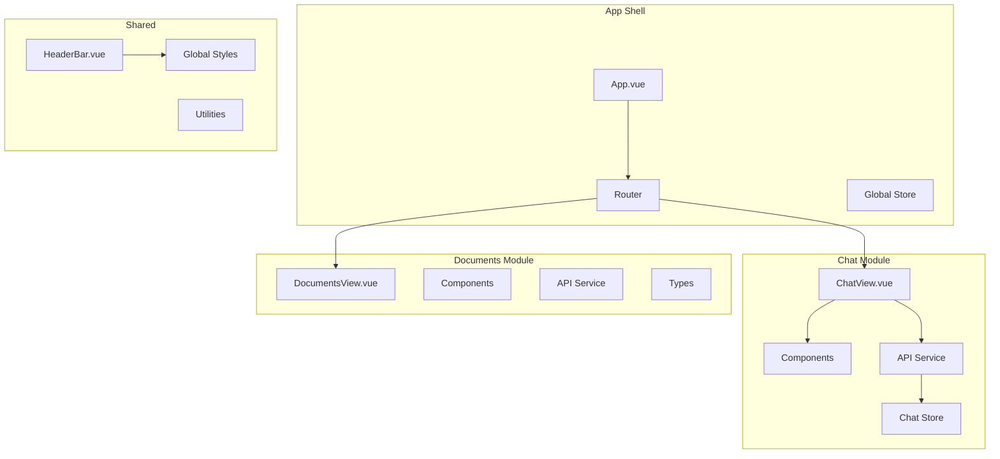

# Frontend - Vue.js 3 Application

## 🎨 Visão Geral

O frontend do RAGBot é uma **Single Page Application (SPA)** moderna desenvolvida em **Vue.js 3** com **TypeScript**, proporcionando uma experiência de usuário fluida e responsiva. A interface foi inspirada no design do ChatGPT, mas adaptada para o contexto específico de consultas sobre documentos.

### ✨ Características Principais

- 🎨 **Interface moderna** estilo ChatGPT
- 🌙 **Tema claro/escuro** com persistência
- 📱 **Totalmente responsiva** (mobile-first)
- ⚡ **Performance otimizada** com Vite
- 🔒 **Type-safe** com TypeScript
- ♿ **Acessível** (ARIA, keyboard navigation)
- 🧪 **Testável** com Vitest

---

## 📁 Estrutura do Projeto

```
src/
├── App.vue                     # Componente raiz
├── main.ts                     # Entry point da aplicação
├── style.css                   # Estilos globais + Tailwind
│
├── modules/                    # Módulos organizados por feature
│   ├── index.ts               # Exports dos módulos
│   ├── README.md              # Documentação da arquitetura modular
│   │
│   ├── chat/                  # Módulo de Chat
│   │   ├── index.ts           # Exports do módulo chat
│   │   ├── components/        # Componentes específicos do chat
│   │   │   ├── ChatBubble.vue       # Balões de mensagem
│   │   │   ├── MessageInput.vue     # Input de mensagem
│   │   │   └── TypingIndicator.vue  # Indicador de digitação
│   │   ├── router/            # Rotas do módulo
│   │   │   └── index.ts
│   │   ├── services/          # Serviços de API
│   │   │   └── api.ts
│   │   ├── stores/            # State management com Pinia
│   │   │   └── chatStore.ts
│   │   └── views/             # Views/páginas do módulo
│   │       └── ChatView.vue
│   │
│   └── documents/             # Módulo de Documentos
│       ├── index.ts
│       ├── components/
│       │   └── DocumentList.vue
│       ├── router/
│       ├── services/
│       │   └── api.ts
│       ├── types/
│       │   └── index.ts
│       └── views/
│           └── DocumentsView.vue
│
├── router/                     # Configuração de rotas globais
│   └── index.ts
│
└── shared/                     # Componentes compartilhados
    └── components/
        └── HeaderBar.vue       # Cabeçalho da aplicação
```

---

## 🧩 Arquitetura Modular

### Filosofia de Organização

O projeto utiliza uma **arquitetura modular** onde cada feature é um módulo independente com sua própria estrutura MVC:



### Vantagens da Abordagem Modular

- ✅ **Separação clara** de responsabilidades
- ✅ **Reutilização** de componentes
- ✅ **Manutenibilidade** aprimorada
- ✅ **Escalabilidade** para novas features
- ✅ **Testing** independente por módulo

---

## 💬 Módulo Chat - Arquitetura Detalhada

### ChatView.vue - Componente Principal

```vue
<template>
  <div class="min-h-screen bg-gray-50 dark:bg-gray-900">
    <HeaderBar />
    
    <main class="flex flex-col min-h-[calc(100vh-4rem)]">
      <!-- Welcome Screen -->
      <div v-if="messages.length === 0" class="flex-1">
        <WelcomeSection @example-click="handleExampleClick" />
      </div>
      
      <!-- Chat Messages -->
      <div v-else class="flex-1 overflow-y-auto">
        <ChatBubble 
          v-for="message in messages"
          :key="message.id"
          :role="message.role"
          :content="message.content"
        />
        <TypingIndicator v-if="isLoading" />
      </div>
      
      <!-- Error Display -->
      <ErrorMessage 
        v-if="errorMessage"
        :message="errorMessage"
        @retry="retryLastMessage"
      />
      
      <!-- Message Input -->
      <MessageInput 
        :is-loading="isLoading"
        @submit="handleMessageSubmit"
      />
    </main>
  </div>
</template>

<script setup lang="ts">
import { ref, nextTick } from 'vue'
import type { Message } from '@/types'

// Reactive state
const messages = ref<Message[]>([])
const isLoading = ref(false)
const errorMessage = ref('')
const conversationId = ref<string>()

// Methods
const handleMessageSubmit = async (message: string) => {
  // Implementation details...
}
</script>
```

### ChatBubble.vue - Componente de Mensagem

```vue
<template>
  <div class="flex items-start space-x-3 max-w-4xl mx-auto px-4 py-4">
    <!-- Avatar -->
    <div class="flex-shrink-0">
      <div :class="avatarClasses">
        <component :is="avatarIcon" class="w-4 h-4" />
      </div>
    </div>
    
    <!-- Message Content -->
    <div class="flex-1 min-w-0">
      <div :class="messageClasses">
        <!-- User message - plain text -->
        <p v-if="role === 'user'" class="whitespace-pre-wrap">
          {{ content }}
        </p>
        
        <!-- Assistant message - rendered markdown -->
        <div 
          v-else 
          class="prose prose-sm dark:prose-invert max-w-none"
          v-html="renderedContent"
        />
      </div>
      
      <!-- Message metadata -->
      <div class="mt-2 flex items-center space-x-2 text-xs text-gray-500">
        <span>{{ formatTime(timestamp) }}</span>
        <button 
          v-if="role === 'assistant'"
          @click="copyMessage"
          class="hover:text-gray-700 dark:hover:text-gray-300"
        >
          Copiar
        </button>
      </div>
    </div>
  </div>
</template>

<script setup lang="ts">
import { computed } from 'vue'
import { marked } from 'marked'

interface Props {
  role: 'user' | 'assistant'
  content: string
  timestamp?: Date
}

const props = withDefaults(defineProps<Props>(), {
  timestamp: () => new Date()
})

// Computed styles
const avatarClasses = computed(() => [
  'w-8 h-8 rounded-full flex items-center justify-center',
  props.role === 'user' 
    ? 'bg-blue-500 text-white' 
    : 'bg-gray-200 dark:bg-gray-700 text-gray-600 dark:text-gray-300'
])

const messageClasses = computed(() => [
  'rounded-lg px-4 py-3 shadow-sm border',
  props.role === 'user'
    ? 'bg-blue-500 text-white border-blue-500'
    : 'bg-white dark:bg-gray-800 border-gray-200 dark:border-gray-700'
])

// Markdown rendering for assistant messages
const renderedContent = computed(() => {
  if (props.role === 'user') return props.content
  
  return marked(props.content, {
    breaks: true,
    gfm: true
  })
})

// Utility methods
const formatTime = (date: Date) => {
  return date.toLocaleTimeString('pt-BR', { 
    hour: '2-digit', 
    minute: '2-digit' 
  })
}

const copyMessage = () => {
  navigator.clipboard.writeText(props.content)
  // Show toast notification (implementation depends on notification system)
}
</script>
```

### MessageInput.vue - Input de Mensagem

```vue
<template>
  <div class="border-t border-gray-200 dark:border-gray-700 bg-white dark:bg-gray-800">
    <div class="max-w-4xl mx-auto px-4 py-4">
      <form @submit.prevent="handleSubmit" class="flex space-x-3">
        <!-- Text Input -->
        <div class="flex-1 relative">
          <textarea
            ref="textareaRef"
            v-model="message"
            :disabled="isLoading"
            :placeholder="placeholder"
            @keydown="handleKeydown"
            @input="adjustHeight"
            class="w-full resize-none rounded-lg border border-gray-300 dark:border-gray-600 bg-white dark:bg-gray-700 px-4 py-3 pr-12 text-gray-900 dark:text-white placeholder-gray-500 dark:placeholder-gray-400 focus:border-blue-500 focus:ring-blue-500 disabled:opacity-50 disabled:cursor-not-allowed"
            :style="{ height: textareaHeight }"
            rows="1"
            maxlength="1000"
          />
          
          <!-- Character counter -->
          <div 
            v-if="message.length > 800"
            class="absolute bottom-1 right-12 text-xs"
            :class="message.length > 950 ? 'text-red-500' : 'text-gray-400'"
          >
            {{ message.length }}/1000
          </div>
        </div>
        
        <!-- Send Button -->
        <button
          type="submit"
          :disabled="!canSend"
          class="flex-shrink-0 rounded-lg px-6 py-3 bg-blue-500 text-white font-medium hover:bg-blue-600 focus:outline-none focus:ring-2 focus:ring-blue-500 focus:ring-offset-2 disabled:opacity-50 disabled:cursor-not-allowed transition-colors duration-200"
        >
          <span v-if="!isLoading">Enviar</span>
          <svg
            v-else
            class="w-5 h-5 animate-spin"
            fill="none"
            viewBox="0 0 24 24"
          >
            <circle
              class="opacity-25"
              cx="12"
              cy="12"
              r="10"
              stroke="currentColor"
              stroke-width="4"
            />
            <path
              class="opacity-75"
              fill="currentColor"
              d="M4 12a8 8 0 018-8V0C5.373 0 0 5.373 0 12h4zm2 5.291A7.962 7.962 0 014 12H0c0 3.042 1.135 5.824 3 7.938l3-2.647z"
            />
          </svg>
        </button>
      </form>
      
      <!-- Hint text -->
      <p class="mt-2 text-xs text-gray-500 dark:text-gray-400 text-center">
        Pressione Enter para enviar, Shift+Enter para nova linha
      </p>
    </div>
  </div>
</template>

<script setup lang="ts">
import { ref, computed, nextTick } from 'vue'

interface Props {
  isLoading?: boolean
  placeholder?: string
}

const props = withDefaults(defineProps<Props>(), {
  placeholder: 'Digite sua mensagem...'
})

const emit = defineEmits<{
  submit: [message: string]
}>()

// State
const message = ref('')
const textareaRef = ref<HTMLTextAreaElement>()
const textareaHeight = ref('auto')

// Computed
const canSend = computed(() => 
  message.value.trim().length > 0 && !props.isLoading
)

// Methods
const handleSubmit = () => {
  if (!canSend.value) return
  
  const messageToSend = message.value.trim()
  message.value = ''
  resetHeight()
  emit('submit', messageToSend)
}

const handleKeydown = (event: KeyboardEvent) => {
  if (event.key === 'Enter' && !event.shiftKey) {
    event.preventDefault()
    handleSubmit()
  }
}

const adjustHeight = async () => {
  await nextTick()
  if (!textareaRef.value) return
  
  const textarea = textareaRef.value
  textarea.style.height = 'auto'
  const newHeight = Math.min(textarea.scrollHeight, 120) // Max 120px
  textareaHeight.value = `${newHeight}px`
}

const resetHeight = () => {
  textareaHeight.value = 'auto'
  nextTick(() => {
    if (textareaRef.value) {
      textareaRef.value.style.height = 'auto'
    }
  })
}
</script>
```

---

## 🏪 State Management com Pinia

### Chat Store - Gerenciamento de Estado

```typescript
// stores/chatStore.ts
import { ref, computed } from 'vue'
import { defineStore } from 'pinia'
import type { Message, ChatResponse } from '@/types'
import ApiService from '@/services/api'

export const useChatStore = defineStore('chat', () => {
  // State
  const messages = ref<Message[]>([])
  const isLoading = ref(false)
  const errorMessage = ref('')
  const conversationId = ref<string>()
  
  // Getters
  const messageCount = computed(() => messages.value.length)
  const lastMessage = computed(() => 
    messages.value[messages.value.length - 1]
  )
  const hasMessages = computed(() => messages.value.length > 0)
  
  // Actions
  const addMessage = (role: 'user' | 'assistant', content: string) => {
    const message: Message = {
      id: generateId(),
      role,
      content,
      timestamp: new Date()
    }
    messages.value.push(message)
    return message
  }
  
  const sendMessage = async (content: string) => {
    // Clear any previous errors
    errorMessage.value = ''
    
    // Add user message
    const userMessage = addMessage('user', content)
    
    // Set loading state
    isLoading.value = true
    
    try {
      const response = await ApiService.sendMessage(
        content, 
        conversationId.value
      )
      
      if (response.success) {
        // Update conversation ID
        if (response.conversationId) {
          conversationId.value = response.conversationId
        }
        
        // Add assistant response
        addMessage('assistant', response.answer)
      } else {
        errorMessage.value = response.error || 'Erro desconhecido'
      }
    } catch (error) {
      console.error('Error sending message:', error)
      errorMessage.value = 'Falha na conexão com o servidor'
    } finally {
      isLoading.value = false
    }
  }
  
  const clearConversation = () => {
    messages.value = []
    conversationId.value = undefined
    errorMessage.value = ''
  }
  
  const retryLastMessage = () => {
    if (messages.value.length >= 2) {
      const lastUserMessage = messages.value
        .slice()
        .reverse()
        .find(m => m.role === 'user')
      
      if (lastUserMessage) {
        // Remove last assistant message if it was an error
        if (lastMessage.value?.role === 'assistant') {
          messages.value.pop()
        }
        
        sendMessage(lastUserMessage.content)
      }
    }
  }
  
  return {
    // State
    messages: readonly(messages),
    isLoading: readonly(isLoading),
    errorMessage: readonly(errorMessage),
    conversationId: readonly(conversationId),
    
    // Getters
    messageCount,
    lastMessage,
    hasMessages,
    
    // Actions
    addMessage,
    sendMessage,
    clearConversation,
    retryLastMessage
  }
})

// Utility function
function generateId(): string {
  return `${Date.now()}-${Math.random().toString(36).substr(2, 9)}`
}
```

### Theme Store - Gerenciamento de Tema

```typescript
// stores/themeStore.ts
import { ref, computed } from 'vue'
import { defineStore } from 'pinia'

type Theme = 'light' | 'dark' | 'auto'

export const useThemeStore = defineStore('theme', () => {
  // Load initial theme from localStorage
  const storedTheme = localStorage.getItem('ragbot-theme') as Theme
  const theme = ref<Theme>(storedTheme || 'auto')
  
  // System preference detection
  const prefersDark = ref(
    window.matchMedia('(prefers-color-scheme: dark)').matches
  )
  
  // Watch for system preference changes
  const mediaQuery = window.matchMedia('(prefers-color-scheme: dark)')
  mediaQuery.addEventListener('change', (e) => {
    prefersDark.value = e.matches
    applyTheme()
  })
  
  // Computed
  const isDark = computed(() => {
    return theme.value === 'dark' || 
           (theme.value === 'auto' && prefersDark.value)
  })
  
  const themeIcon = computed(() => {
    switch (theme.value) {
      case 'light': return 'sun'
      case 'dark': return 'moon'
      default: return 'computer'
    }
  })
  
  // Actions
  const setTheme = (newTheme: Theme) => {
    theme.value = newTheme
    localStorage.setItem('ragbot-theme', newTheme)
    applyTheme()
  }
  
  const toggleTheme = () => {
    const themes: Theme[] = ['light', 'dark', 'auto']
    const currentIndex = themes.indexOf(theme.value)
    const nextIndex = (currentIndex + 1) % themes.length
    setTheme(themes[nextIndex])
  }
  
  const applyTheme = () => {
    const html = document.documentElement
    
    if (isDark.value) {
      html.classList.add('dark')
    } else {
      html.classList.remove('dark')
    }
  }
  
  // Initialize theme on store creation
  applyTheme()
  
  return {
    theme: readonly(theme),
    isDark,
    themeIcon,
    setTheme,
    toggleTheme
  }
})
```

---

## 🛡️ API Service Layer

### API Service - Comunicação com Backend

```typescript
// services/api.ts
import type { ChatResponse, DocumentUploadResponse } from '@/types'

class ApiService {
  private baseUrl: string
  
  constructor() {
    this.baseUrl = import.meta.env.VITE_API_BASE_URL || ''
  }
  
  async sendMessage(
    question: string, 
    conversationId?: string, 
    maxChunks: number = 5
  ): Promise<ChatResponse> {
    try {
      // Use mock if no base URL configured
      if (!this.baseUrl) {
        return this.getMockResponse(question)
      }
      
      console.log('🔵 [API] Sending message:', { question, conversationId, maxChunks })
      
      const response = await fetch(`${this.baseUrl}/api/chat`, {
        method: 'POST',
        headers: { 'Content-Type': 'application/json' },
        body: JSON.stringify({
          message: question,
          conversation_id: conversationId,
          max_chunks: maxChunks
        })
      })
      
      console.log('🔵 [API] Response status:', response.status)
      
      if (!response.ok) {
        const errorData = await response.json().catch(() => ({ 
          detail: 'Erro desconhecido' 
        }))
        
        throw new Error(errorData.detail || `HTTP ${response.status}`)
      }
      
      const data = await response.json()
      console.log('✅ [API] Success response received')
      
      return {
        success: true,
        answer: data.response,
        conversationId: data.conversation_id,
        messageId: data.message_id,
        sources: data.sources || [],
        processingTime: data.processing_time
      }
      
    } catch (error) {
      console.error('🔴 [API] Error:', error)
      
      return {
        success: false,
        answer: '',
        error: error instanceof Error ? error.message : 'Erro de rede'
      }
    }
  }
  
  async uploadDocument(file: File): Promise<DocumentUploadResponse> {
    try {
      if (!this.baseUrl) {
        throw new Error('API não configurada para upload')
      }
      
      const formData = new FormData()
      formData.append('file', file)
      
      const response = await fetch(`${this.baseUrl}/api/documents/upload`, {
        method: 'POST',
        body: formData
      })
      
      if (!response.ok) {
        const errorData = await response.json().catch(() => ({ 
          detail: 'Erro no upload' 
        }))
        throw new Error(errorData.detail)
      }
      
      return await response.json()
      
    } catch (error) {
      throw new Error(
        error instanceof Error ? error.message : 'Erro no upload'
      )
    }
  }
  
  private getMockResponse(question: string): ChatResponse {
    // Mock responses for development
    const mockResponses = [
      "Esta é uma resposta simulada para desenvolvimento. Configure VITE_API_BASE_URL para conectar ao backend real.",
      "O RAGBot está funcionando em modo de desenvolvimento com respostas simuladas.",
      "Para obter respostas reais, certifique-se de que o backend está rodando na porta 8000."
    ]
    
    const randomResponse = mockResponses[
      Math.floor(Math.random() * mockResponses.length)
    ]
    
    return {
      success: true,
      answer: `**Pergunta:** ${question}\n\n**Resposta:** ${randomResponse}`,
      conversationId: 'mock-conversation-id',
      messageId: `mock-${Date.now()}`,
      sources: [],
      processingTime: Math.random() * 2 + 0.5
    }
  }
}

export default new ApiService()
```

---

## 🎨 Sistema de Design e Estilos

### Tailwind CSS Configuration

```javascript
// tailwind.config.js
module.exports = {
  content: ['./index.html', './src/**/*.{vue,js,ts,jsx,tsx}'],
  darkMode: 'class', // Enable class-based dark mode
  theme: {
    extend: {
      colors: {
        // Custom color palette
        primary: {
          50: '#eff6ff',
          100: '#dbeafe', 
          200: '#bfdbfe',
          300: '#93c5fd',
          400: '#60a5fa',
          500: '#3b82f6',  // Main blue
          600: '#2563eb',
          700: '#1d4ed8',
          800: '#1e40af',
          900: '#1e3a8a'
        },
        gray: {
          50: '#f9fafb',
          100: '#f3f4f6',
          200: '#e5e7eb', 
          300: '#d1d5db',
          400: '#9ca3af',
          500: '#6b7280',
          600: '#4b5563',
          700: '#374151',
          800: '#1f2937',
          900: '#111827'
        }
      },
      fontFamily: {
        sans: ['Inter', 'system-ui', 'sans-serif']
      },
      typography: {
        DEFAULT: {
          css: {
            maxWidth: 'none',
            color: 'inherit',
            a: {
              color: '#3b82f6',
              textDecoration: 'underline',
              '&:hover': {
                color: '#1d4ed8'
              }
            }
          }
        }
      },
      animation: {
        'fade-in': 'fadeIn 0.5s ease-in-out',
        'slide-up': 'slideUp 0.3s ease-out',
        'pulse-slow': 'pulse 3s infinite'
      },
      keyframes: {
        fadeIn: {
          '0%': { opacity: '0', transform: 'translateY(10px)' },
          '100%': { opacity: '1', transform: 'translateY(0)' }
        },
        slideUp: {
          '0%': { opacity: '0', transform: 'translateY(20px)' },
          '100%': { opacity: '1', transform: 'translateY(0)' }
        }
      }
    }
  },
  plugins: [
    require('@tailwindcss/typography'),
    require('@tailwindcss/forms')
  ]
}
```

### Custom CSS Components

```css
/* style.css */
@import 'tailwindcss/base';
@import 'tailwindcss/components';
@import 'tailwindcss/utilities';

/* Custom components */
@layer components {
  .btn {
    @apply px-4 py-2 rounded-lg font-medium transition-colors duration-200 focus:outline-none focus:ring-2 focus:ring-offset-2;
  }
  
  .btn-primary {
    @apply btn bg-blue-500 text-white hover:bg-blue-600 focus:ring-blue-500;
  }
  
  .btn-secondary {
    @apply btn bg-gray-200 text-gray-900 hover:bg-gray-300 focus:ring-gray-500;
  }
  
  .input-field {
    @apply w-full px-4 py-3 border border-gray-300 dark:border-gray-600 rounded-lg bg-white dark:bg-gray-700 text-gray-900 dark:text-white placeholder-gray-500 focus:border-blue-500 focus:ring-blue-500;
  }
  
  .card {
    @apply bg-white dark:bg-gray-800 rounded-lg shadow-sm border border-gray-200 dark:border-gray-700;
  }
  
  .prose-custom {
    @apply prose prose-sm dark:prose-invert max-w-none;
  }
}

/* Custom scrollbar */
::-webkit-scrollbar {
  width: 8px;
}

::-webkit-scrollbar-track {
  background: transparent;
}

::-webkit-scrollbar-thumb {
  background: theme('colors.gray.400');
  border-radius: 4px;
}

.dark ::-webkit-scrollbar-thumb {
  background: theme('colors.gray.600');
}

/* Smooth transitions for theme switching */
* {
  transition: color 0.2s ease, background-color 0.2s ease, border-color 0.2s ease;
}
```

---

## 📱 Responsividade e Acessibilidade

### Design Responsivo

```vue
<!-- Exemplo de componente responsivo -->
<template>
  <div class="grid gap-4 sm:grid-cols-2 lg:grid-cols-3 xl:grid-cols-4">
    <!-- Breakpoints: sm(640px), md(768px), lg(1024px), xl(1280px) -->
  </div>
  
  <!-- Stack vertical em mobile, horizontal em desktop -->
  <div class="flex flex-col sm:flex-row space-y-4 sm:space-y-0 sm:space-x-4">
    <!-- Conteúdo -->
  </div>
  
  <!-- Texto responsivo -->
  <h1 class="text-2xl sm:text-3xl lg:text-4xl xl:text-5xl">
    Título Responsivo
  </h1>
</template>
```

### Acessibilidade (A11y)

```vue
<!-- Boas práticas implementadas -->
<template>
  <div>
    <!-- ARIA labels -->
    <button 
      :aria-label="isLoading ? 'Enviando mensagem...' : 'Enviar mensagem'"
      :aria-disabled="isLoading"
    >
      Enviar
    </button>
    
    <!-- Landmark roles -->
    <main role="main">
      <section aria-labelledby="chat-heading">
        <h1 id="chat-heading">Chat com RAGBot</h1>
      </section>
    </main>
    
    <!-- Keyboard navigation -->
    <div 
      tabindex="0"
      @keydown.enter="handleAction"
      @keydown.space="handleAction"
    >
      Elemento interativo
    </div>
    
    <!-- Focus management -->
    <input 
      ref="inputRef"
      @focus="onInputFocus"
      @blur="onInputBlur"
    />
  </div>
</template>

<script setup>
// Focus management
const focusInput = () => {
  nextTick(() => {
    inputRef.value?.focus()
  })
}

// Keyboard shortcuts
onMounted(() => {
  const handleKeyboard = (e) => {
    // Ctrl/Cmd + K para focar no input
    if ((e.ctrlKey || e.metaKey) && e.key === 'k') {
      e.preventDefault()
      focusInput()
    }
    
    // Escape para fechar modals
    if (e.key === 'Escape') {
      closeModals()
    }
  }
  
  window.addEventListener('keydown', handleKeyboard)
  onUnmounted(() => {
    window.removeEventListener('keydown', handleKeyboard)
  })
})
</script>
```

---

## 🧪 Testing Strategy

### Unit Tests com Vitest

```typescript
// __tests__/ChatBubble.spec.ts
import { describe, it, expect } from 'vitest'
import { mount } from '@vue/test-utils'
import ChatBubble from '@/modules/chat/components/ChatBubble.vue'

describe('ChatBubble', () => {
  it('renders user message correctly', () => {
    const wrapper = mount(ChatBubble, {
      props: {
        role: 'user',
        content: 'Test message'
      }
    })
    
    expect(wrapper.text()).toContain('Test message')
    expect(wrapper.find('.bg-blue-500')).toBeTruthy()
  })
  
  it('renders assistant message with markdown', () => {
    const wrapper = mount(ChatBubble, {
      props: {
        role: 'assistant',
        content: '**Bold text** and *italic text*'
      }
    })
    
    const html = wrapper.html()
    expect(html).toContain('<strong>Bold text</strong>')
    expect(html).toContain('<em>italic text</em>')
  })
  
  it('shows copy button only for assistant messages', () => {
    const userWrapper = mount(ChatBubble, {
      props: { role: 'user', content: 'User message' }
    })
    
    const assistantWrapper = mount(ChatBubble, {
      props: { role: 'assistant', content: 'Assistant message' }
    })
    
    expect(userWrapper.find('[data-testid="copy-button"]').exists()).toBe(false)
    expect(assistantWrapper.find('[data-testid="copy-button"]').exists()).toBe(true)
  })
})
```

### E2E Tests Setup

```typescript
// e2e/chat.spec.ts
import { test, expect } from '@playwright/test'

test.describe('Chat Flow', () => {
  test('should send message and receive response', async ({ page }) => {
    await page.goto('/')
    
    // Should show welcome screen
    await expect(page.getByText('Bem-vindo ao RAGBot')).toBeVisible()
    
    // Type and send message
    const input = page.getByPlaceholder('Digite sua mensagem...')
    await input.fill('Como funciona o sistema?')
    await page.getByRole('button', { name: 'Enviar' }).click()
    
    // Should show user message
    await expect(page.getByText('Como funciona o sistema?')).toBeVisible()
    
    // Should show loading indicator
    await expect(page.getByTestId('typing-indicator')).toBeVisible()
    
    // Should receive response
    await expect(page.getByTestId('assistant-message')).toBeVisible()
    await expect(page.getByTestId('typing-indicator')).not.toBeVisible()
  })
  
  test('should handle theme switching', async ({ page }) => {
    await page.goto('/')
    
    // Should start with light theme
    await expect(page.locator('html')).not.toHaveClass(/dark/)
    
    // Click theme toggle
    await page.getByTestId('theme-toggle').click()
    
    // Should switch to dark theme
    await expect(page.locator('html')).toHaveClass(/dark/)
  })
})
```

---

## 📈 Performance e Otimizações

### Code Splitting

```typescript
// router/index.ts
import { createRouter, createWebHistory } from 'vue-router'

const router = createRouter({
  history: createWebHistory(),
  routes: [
    {
      path: '/',
      name: 'chat',
      // Lazy loading para reduzir bundle inicial
      component: () => import('@/modules/chat/views/ChatView.vue')
    },
    {
      path: '/documents',
      name: 'documents', 
      component: () => import('@/modules/documents/views/DocumentsView.vue')
    }
  ]
})

export default router
```

### Bundle Analysis

```javascript
// vite.config.ts
export default defineConfig({
  build: {
    rollupOptions: {
      output: {
        manualChunks: {
          // Vendor chunks
          'vendor-vue': ['vue', 'vue-router', 'pinia'],
          'vendor-ui': ['marked'],
          // Component chunks
          'chat-components': [
            './src/modules/chat/components/ChatBubble.vue',
            './src/modules/chat/components/MessageInput.vue'
          ]
        }
      }
    },
    // Generate source maps for debugging
    sourcemap: true
  }
})
```

### Performance Metrics

| Métrica | Target | Implementação |
|---------|--------|---------------|
| **First Contentful Paint** | < 1.5s | Code splitting + CDN |
| **Largest Contentful Paint** | < 2.5s | Image optimization + preload |
| **Time to Interactive** | < 3s | Lazy loading + minimal JS |
| **Cumulative Layout Shift** | < 0.1 | Reserved space + CSS grid |

---

## 🔮 Roadmap Frontend

### v1.1 - Enhanced UX
- ✨ **Streaming responses** com Server-Sent Events
- 💾 **Conversation history** persistente
- 🔍 **Search dentro** das conversas
- 📊 **Indicadores de progresso** melhorados

### v1.2 - Advanced Features  
- 🎨 **Temas customizáveis** pelo usuário
- 🌐 **Internacionalização** (i18n)
- 📱 **PWA** com notificações push
- 🎙️ **Input por voz** (speech-to-text)

### v1.3 - Collaboration
- 👥 **Conversas compartilhadas** entre usuários
- 💬 **Comentários** em mensagens
- 📤 **Export/import** de conversas
- 🔗 **Deep linking** para mensagens específicas

---

!!! success "Frontend Moderno e Escalável"
    O frontend do RAGBot utiliza as melhores práticas de desenvolvimento Vue.js 3, proporcionando uma **experiência de usuário excepcional** com **performance otimizada** e **código maintível**.

**Última atualização:** 19 de novembro de 2025

Informações sobre a interface do usuário, componentes principais e diretrizes de design do frontend.
