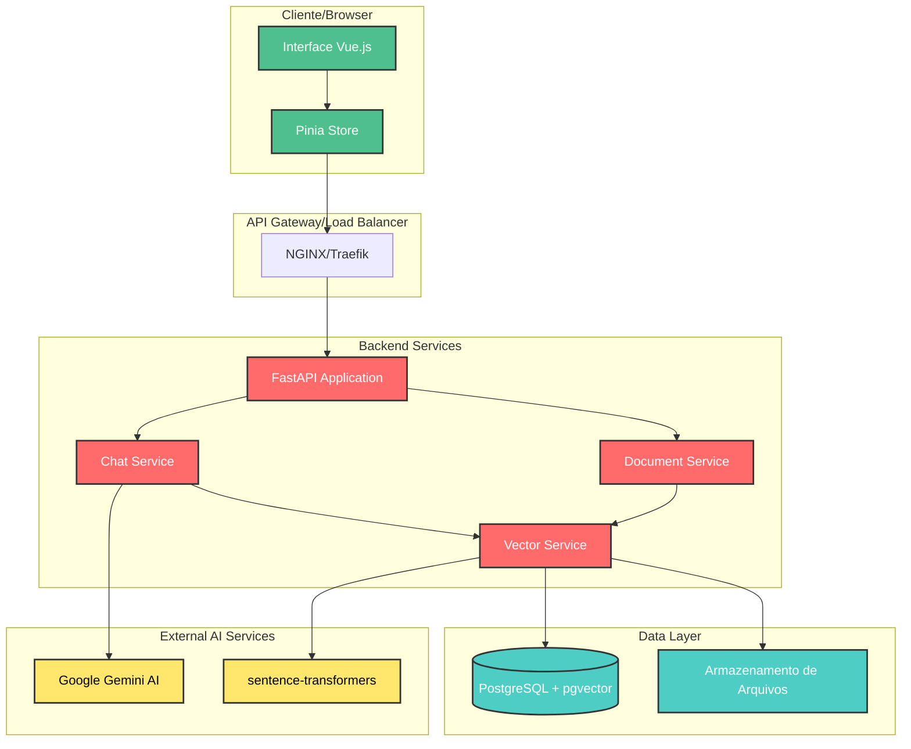
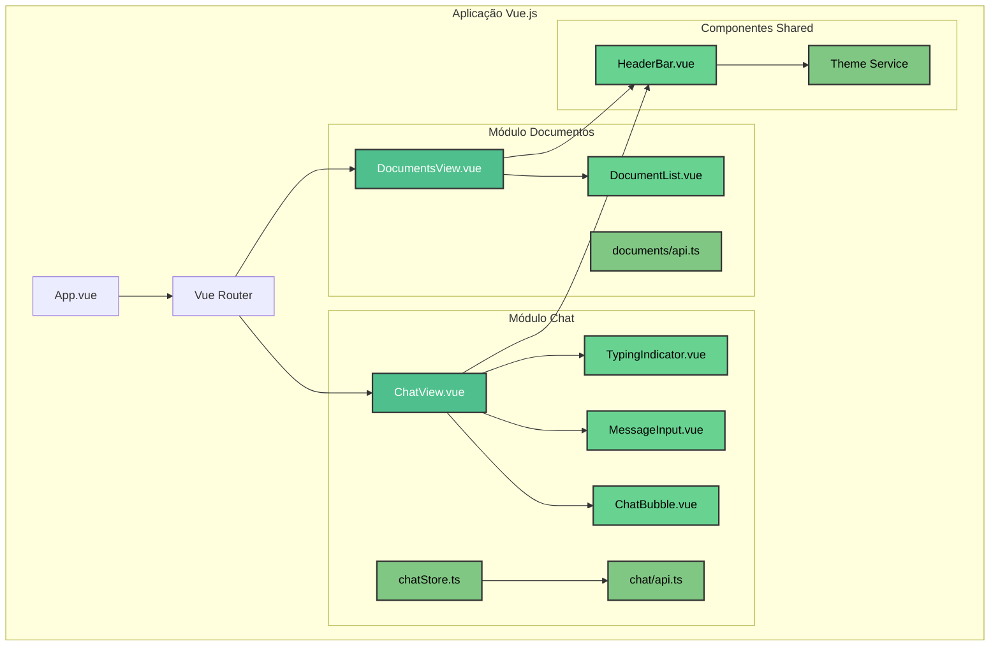
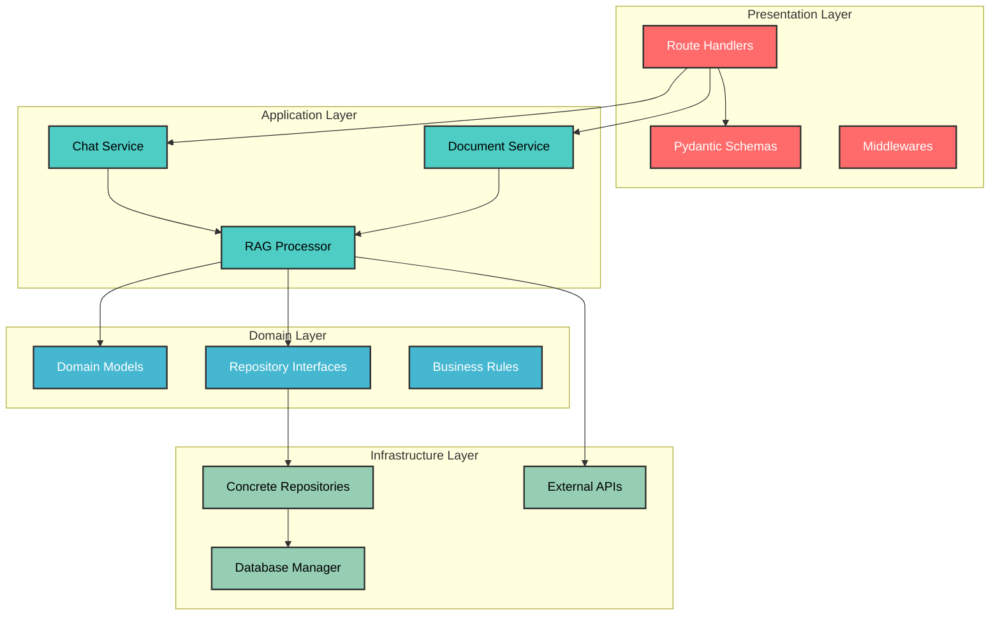
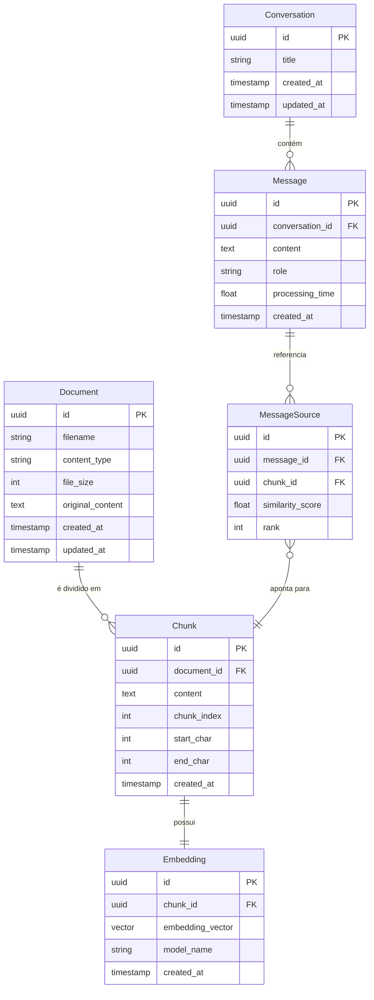
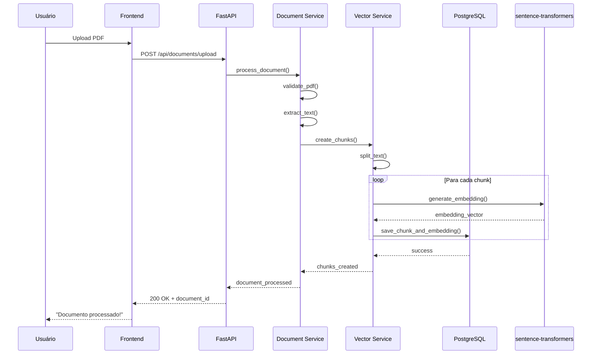
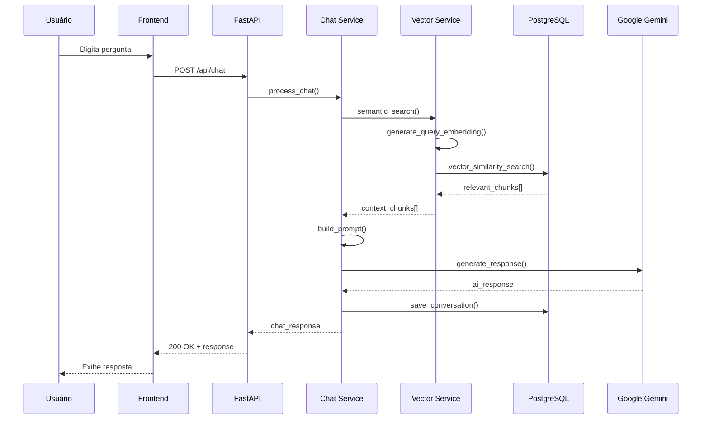

# Arquitetura do Sistema RAGBot

## 📐 Visão Arquitetural Geral

O RAGBot foi projetado seguindo os princípios de **arquitetura limpa** e **separação de responsabilidades**, implementando uma solução robusta e escalável para processamento de documentos e geração de respostas inteligentes.

### 🎯 Princípios Arquiteturais

- **🔄 Separação de Responsabilidades**: Cada camada tem uma responsabilidade específica
- **🔌 Baixo Acoplamento**: Módulos independentes e facilmente testáveis
- **📈 Escalabilidade**: Arquitetura preparada para crescimento horizontal
- **🛡️ Segurança**: Validação rigorosa em todas as camadas
- **⚡ Performance**: Otimizações para busca vetorial e processamento de documentos

---

## 🏗️ Arquitetura de Alto Nível



---

## 🎨 Frontend - Vue.js 3 Architecture

### 📱 Arquitetura de Componentes



### 🔧 Tecnologias Frontend

| Componente | Tecnologia | Versão | Responsabilidade |
|------------|------------|--------|------------------|
| **Framework** | Vue.js | 3.5+ | Reatividade e componentes |
| **Build Tool** | Vite | 7.1+ | Bundling e dev server |
| **Roteamento** | Vue Router | 4.5+ | SPA routing |
| **Estado** | Pinia | 3.0+ | State management |
| **Styling** | Tailwind CSS | 3.4+ | Utility-first CSS |
| **Type Safety** | TypeScript | 5.9+ | Tipagem estática |
| **Markdown** | Marked | 16.3+ | Renderização de respostas |

---

## ⚙️ Backend - FastAPI Architecture

### 🏛️ Clean Architecture Implementation



### 📁 Estrutura de Diretórios Backend

```
app/
├── __init__.py                 # Inicialização do módulo
├── main.py                     # Entry point da aplicação
├── application.py              # Configuração FastAPI
│
├── config/                     # Configurações
│   ├── settings.py            # Variáveis de ambiente
│   └── constants.py           # Constantes da aplicação
│
├── routes/                     # Camada de Apresentação
│   ├── core_routes.py         # Health check e métricas
│   ├── chat_routes.py         # Endpoints de chat
│   └── document_routes.py     # Endpoints de documentos
│
├── schemas/                    # Validação de Dados
│   ├── chat_schemas.py        # DTOs de chat
│   ├── document_schemas.py    # DTOs de documentos
│   └── shared_schemas.py      # DTOs compartilhados
│
├── services/                   # Camada de Aplicação
│   ├── chat_service.py        # Lógica de negócio do chat
│   └── document_service.py    # Lógica de negócio de documentos
│
└── repositories/              # Camada de Dados
    ├── chat_repository.py     # Persistência de conversas
    ├── document_repository.py # Persistência de documentos
    └── vector_repository.py   # Operações vetoriais
```

---

## 🗄️ Arquitetura de Dados

### 📊 Modelo Conceitual



### 🔍 Índices e Otimizações

```sql
-- Índices para Performance
CREATE INDEX idx_chunks_document_id ON chunks(document_id);
CREATE INDEX idx_embeddings_chunk_id ON embeddings(chunk_id);
CREATE INDEX idx_messages_conversation_id ON messages(conversation_id);
CREATE INDEX idx_messages_created_at ON messages(created_at DESC);

-- Índice HNSW para busca vetorial (pgvector)
CREATE INDEX ON embeddings USING hnsw (embedding_vector vector_cosine_ops);

-- Índice GIN para busca textual
CREATE INDEX idx_chunks_content_gin ON chunks USING gin(to_tsvector('portuguese', content));
```

---

## 🤖 Fluxo RAG (Retrieval-Augmented Generation)

### 📄 Processo de Ingestão de Documentos



### 💬 Processo de Chat/Pergunta



---

## 🔧 Componentes e Responsabilidades

### 🎯 Chat Service
**Responsabilidades:**
- Orquestrar o fluxo completo de chat
- Gerenciar contexto de conversações
- Integração com modelo de IA
- Validação de entrada e saída

**Métodos Principais:**
```python
async def process_chat(
    user_message: str,
    max_chunks: int = 5,
    conversation_id: Optional[UUID] = None
) -> ChatResponse
```

### 📄 Document Service
**Responsabilidades:**
- Upload e validação de documentos
- Processamento e extração de texto
- Gerenciamento de metadados
- Limpeza e organização de arquivos

**Métodos Principais:**
```python
def list_documents() -> DocumentListResponse
def delete_document(document_id: UUID) -> DocumentDeleteResponse
async def upload_document(file: UploadFile) -> DocumentUploadResponse
```

### 🔍 Vector Repository
**Responsabilidades:**
- Geração de embeddings
- Busca por similaridade semântica
- Otimização de queries vetoriais
- Cache de resultados

**Métodos Principais:**
```python
async def semantic_search(
    query: str,
    limit: int = 5,
    similarity_threshold: float = 0.7
) -> List[ChunkResult]
```

---

## 🛡️ Padrões de Segurança

### 🔐 Validação e Sanitização

| Camada | Mecanismo | Implementação |
|--------|-----------|---------------|
| **Frontend** | Input Validation | Vue.js reactive validation |
| **API** | Pydantic Schemas | Type validation + sanitization |
| **Serviços** | Business Rules | Domain-specific validation |
| **Banco** | Constraints | FK constraints + data integrity |

### 🚫 Proteções Implementadas

- ✅ **CORS configurado** para origens específicas
- ✅ **Rate limiting** em endpoints críticos  
- ✅ **Validação de tipos** com Pydantic
- ✅ **Sanitização de uploads** (apenas PDFs)
- ✅ **Logging detalhado** para auditoria
- ✅ **Environment variables** para secrets

---

## 📈 Escalabilidade e Performance

### 🚀 Otimizações Implementadas

1. **Database Performance**
   - Índices otimizados para busca vetorial (HNSW)
   - Connection pooling com SQLAlchemy
   - Query optimization para busca semântica

2. **API Performance**  
   - Async/await em todas as operações I/O
   - Pydantic para serialização rápida
   - Logging estruturado com loguru

3. **Frontend Performance**
   - Code splitting com Vite
   - Lazy loading de componentes
   - State management otimizado com Pinia

### 📊 Métricas de Performance

| Operação | Tempo Esperado | Otimização |
|----------|----------------|------------|
| **Upload PDF** | < 5s | Processamento assíncrono |
| **Busca Semântica** | < 500ms | Índice HNSW + cache |
| **Geração de Resposta** | < 3s | API streaming (futuro) |
| **Load Página** | < 2s | Code splitting + CDN |

---

## 🔮 Evolução da Arquitetura

### 📋 Próximas Versões

1. **v1.1 - Streaming**
   - Server-Sent Events para respostas em tempo real
   - Progress indicators durante processamento

2. **v1.2 - Microserviços**
   - Separação em serviços independentes
   - Message queue (Redis/RabbitMQ)

3. **v1.3 - Observabilidade**
   - Metrics com Prometheus
   - Distributed tracing
   - Health checks avançados

4. **v2.0 - Multi-tenancy**
   - Suporte a múltiplas organizações
   - Isolamento de dados por tenant
   - Admin dashboard

---

!!! success "Arquitetura Robusta e Escalável"
    A arquitetura do RAGBot foi projetada para ser **maintível**, **testável** e **escalável**, seguindo as melhores práticas de engenharia de software e preparada para evolução contínua.

Descrição da arquitetura proposta para o RagBot, incluindo componentes, integrações e decisões técnicas relevantes.
