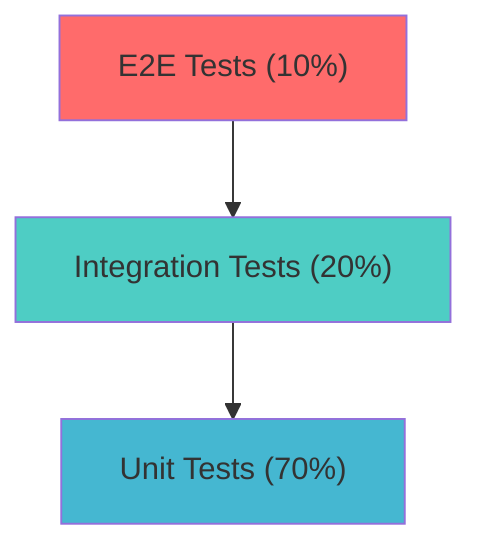
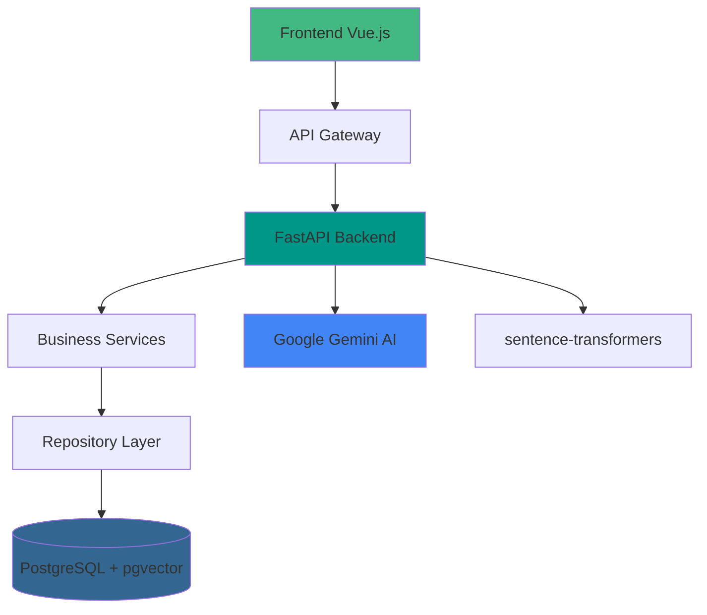

# Metodologia de Desenvolvimento do RAGBot

## 📋 Visão Geral Metodológica

O desenvolvimento do RAGBot adotou uma abordagem **híbrida** que combina as melhores práticas de metodologias ágeis (Scrum/Kanban) com técnicas de **Engenharia de Software** modernas, adaptadas para um projeto de TCC em desenvolvimento solo.

### 🎯 Principios Norteadores

#### 🔄 Agilidade Adaptada
- **Iterações curtas** (sprints de 2 semanas)
- **Entrega incremental** de valor
- **Feedback rápido** e ajustes contínuos
- **Documentação viva** e atualizada
- **Flexibilidade** para mudanças de requisitos

#### 🏗️ Engenharia de Qualidade
- **Clean Architecture** para separação de responsabilidades
- **Test-Driven Development** (TDD) quando aplicável
- **Code Review** rigoroso (self-review + automated tools)
- **Continuous Integration** com GitHub Actions
- **Documentation-as-Code** com MkDocs

#### 🎓 Foco Acadêmico
- **Demonstração de competências** em Engenharia de Software
- **Aplicação prática** de conceitos teóricos
- **Métricas mensuráveis** de qualidade e progresso
- **Documentação profissional** para avaliação
- **Processo reproduzível** para outros projetos

---

## 🔄 Framework Scrum Adaptado

### 🎯 Adaptações para Desenvolvimento Solo

#### 📋 Rituais Scrum Modificados

**Sprint Planning** (2-3 horas por sprint)
- **Self-planning** com definição clara de objetivos
- **Story mapping** detalhado em GitHub Projects
- **Estimativas** baseadas em histórico pessoal
- **Definition of Done** específica para cada item
- **Risk assessment** e planos de contingência

**Daily Standups** (Auto-reflexão de 15 min/dia)
- **Journal digital** com 3 perguntas padrão:
  - ✅ O que foi completado ontem?
  - 🎯 O que será feito hoje?
  - 🚧 Há algum bloqueio ou impedimento?
- **Time tracking** para métricas de velocidade
- **Ajuste de prioridades** baseado em progresso

**Sprint Review** (1-2 horas por sprint)
- **Demo funcional** de features implementadas
- **Validação** contra critérios de aceitação
- **Metrics review** (velocity, quality, coverage)
- **Documentação** de decisões e lições aprendidas
- **Preparação** para próxima sprint

**Sprint Retrospective** (1 hora por sprint)
- **What worked well** (sucessos a manter)
- **What didn't work** (problemas a resolver)  
- **Action items** para melhoria contínua
- **Process refinement** baseado em aprendizados
- **Tools evaluation** e possíveis mudanças

### 📊 Ferramentas de Gestão Utilizadas

#### 🛠️ Stack de Produtividade

| Ferramenta | Propósito | Uso Específico |
|-----------|-----------|----------------|
| **GitHub Projects** | Kanban Board | Sprint planning, backlog management |
| **GitHub Issues** | Story Tracking | User stories, bugs, tasks |
| **GitHub Milestones** | Sprint Management | Sprint goals e deadlines |
| **Notion** | Knowledge Base | Research notes, documentation drafts |
| **Excalidraw** | Visual Planning | Architecture diagrams, wireframes |
| **Toggl** | Time Tracking | Velocity measurement, effort analysis |
| **VS Code** | Development IDE | Code editing, debugging, testing |

#### 📈 Métricas e KPIs Acompanhados

**Velocity Metrics**
- Story Points completados por sprint
- Horas trabalhadas vs. planejadas  
- Burndown rate por sprint
- Feature completion rate

**Quality Metrics**  
- Code coverage percentage
- Test pass rate
- Bug discovery rate
- Technical debt hours

**Process Metrics**
- Sprint goal achievement rate
- Scope creep incidents
- Retrospective action completion
- Documentation completeness

---

## 🏗️ Clean Architecture Implementation

### 📐 Estrutura Arquitetural

#### 🎯 Principios SOLID Aplicados

**Single Responsibility Principle (SRP)**
```python
# Cada classe tem uma única responsabilidade
class DocumentRepository:  # Apenas acesso a dados
    def save(self, document: Document) -> Document:
        pass

class DocumentService:  # Apenas lógica de negócio
    def process_pdf(self, file: UploadFile) -> Document:
        pass

class DocumentController:  # Apenas handling HTTP
    def upload_document(self, file: UploadFile) -> Response:
        pass
```

**Open/Closed Principle (OCP)**
```python
# Extensível para novos tipos sem modificar código existente
class EmbeddingProvider(ABC):
    @abstractmethod
    def generate_embedding(self, text: str) -> List[float]:
        pass

class SentenceTransformerProvider(EmbeddingProvider):
    def generate_embedding(self, text: str) -> List[float]:
        return self.model.encode(text)

# Facilmente extensível para OpenAI, Cohere, etc.
```

**Dependency Inversion Principle (DIP)**
```python
# High-level modules não dependem de low-level modules
class ChatService:
    def __init__(
        self,
        vector_repo: VectorRepository,  # Interface
        llm_provider: LLMProvider       # Interface  
    ):
        self._vector_repo = vector_repo
        self._llm_provider = llm_provider
```

#### 🏛️ Camadas Arquiteturais

**Presentation Layer (Routes)**
- FastAPI routers para HTTP handling
- Request/Response validation com Pydantic
- Error handling e status codes adequados
- OpenAPI documentation automática

**Application Layer (Services)**
- Business logic e use cases
- Orchestração entre repositories
- Validation de regras de negócio
- Transaction management

**Domain Layer (Entities/Schemas)**
- Domain models com Pydantic
- Business rules validation
- Value objects immutáveis
- Domain events (quando necessário)

**Infrastructure Layer (Repositories)**
- Database access patterns
- External API integrations  
- File system operations
- Caching implementations

### 🔄 Dependency Injection Pattern

```python
# Container de dependências com FastAPI
from fastapi import Depends

def get_db_session() -> DatabaseSession:
    # Database session factory
    pass

def get_vector_repository(
    db: DatabaseSession = Depends(get_db_session)
) -> VectorRepository:
    return PostgresVectorRepository(db)

def get_chat_service(
    vector_repo: VectorRepository = Depends(get_vector_repository),
    llm_provider: LLMProvider = Depends(get_llm_provider)
) -> ChatService:
    return ChatService(vector_repo, llm_provider)
```

---

## 🧪 Test-Driven Development (TDD)

### 🔄 Red-Green-Refactor Cycle

#### 🔴 Red Phase (Write Failing Test)
```python
def test_document_upload_should_extract_text():
    # Arrange
    pdf_content = create_sample_pdf()
    
    # Act & Assert (should fail initially)
    with pytest.raises(NotImplementedError):
        result = document_service.process_pdf(pdf_content)
        assert result.text_content is not None
```

#### 🟢 Green Phase (Make Test Pass)
```python
class DocumentService:
    def process_pdf(self, file: UploadFile) -> Document:
        # Minimum implementation to make test pass
        text = extract_text_from_pdf(file)
        return Document(text_content=text)
```

#### 🔵 Refactor Phase (Improve Code Quality)
```python
class DocumentService:
    def __init__(self, pdf_processor: PDFProcessor, 
                 chunking_service: ChunkingService):
        self._pdf_processor = pdf_processor
        self._chunking_service = chunking_service
    
    def process_pdf(self, file: UploadFile) -> Document:
        # Refactored with better separation of concerns
        text = self._pdf_processor.extract_text(file)
        chunks = self._chunking_service.create_chunks(text)
        return Document(text_content=text, chunks=chunks)
```

### 📊 Estratégia de Testes

#### 🧪 Pirâmide de Testes Implementada



**Unit Tests (70% - ~200 testes)**
- Testes isolados de functions/methods
- Mock de dependências externas
- Testes de edge cases e error handling
- Cobertura de ~90% de code coverage

```python
def test_chunking_service_creates_overlapping_chunks():
    # Arrange
    text = "A" * 2000  # Text larger than chunk size
    chunking_service = ChunkingService(chunk_size=1000, overlap=200)
    
    # Act
    chunks = chunking_service.create_chunks(text)
    
    # Assert
    assert len(chunks) == 2
    assert chunks[0][-200:] == chunks[1][:200]  # Overlap verification
```

**Integration Tests (20% - ~50 testes)**
- Testes de endpoints API completos
- Database integration com test containers
- External service integration (mocked)

```python
def test_upload_document_endpoint_integration(client, db_session):
    # Arrange
    pdf_file = create_test_pdf()
    
    # Act
    response = client.post("/documents", files={"file": pdf_file})
    
    # Assert
    assert response.status_code == 201
    assert "document_id" in response.json()
    
    # Verify database persistence
    doc = db_session.query(Document).filter_by(
        id=response.json()["document_id"]
    ).first()
    assert doc is not None
```

**E2E Tests (10% - ~15 testes)**
- Browser automation com Playwright
- Critical user journey testing
- Cross-browser compatibility

```typescript
test('user can upload document and chat about it', async ({ page }) => {
  // Navigate and upload
  await page.goto('/');
  await page.setInputFiles('input[type=file]', 'sample.pdf');
  await expect(page.locator('[data-test="upload-success"]')).toBeVisible();
  
  // Chat interaction
  await page.fill('[data-test="message-input"]', 'What is this document about?');
  await page.click('[data-test="send-button"]');
  await expect(page.locator('[data-test="ai-response"]')).toBeVisible();
});
```

---

## 🚀 DevOps e CI/CD Pipeline

### 🔄 Continuous Integration

#### 📋 GitHub Actions Workflows

**Backend CI Pipeline**
```yaml
name: Backend CI
on: [push, pull_request]

jobs:
  test:
    runs-on: ubuntu-latest
    services:
      postgres:
        image: pgvector/pgvector:pg15
        env:
          POSTGRES_PASSWORD: postgres
        options: >-
          --health-cmd pg_isready
          --health-interval 10s
          --health-timeout 5s
          --health-retries 5
    
    steps:
      - uses: actions/checkout@v3
      - uses: actions/setup-python@v4
        with:
          python-version: '3.11'
      
      - name: Install dependencies
        run: |
          pip install -r requirements.txt
          pip install pytest pytest-cov
      
      - name: Run tests
        run: pytest --cov=app tests/
      
      - name: Upload coverage
        uses: codecov/codecov-action@v3
```

**Frontend CI Pipeline**
```yaml
name: Frontend CI
on: [push, pull_request]

jobs:
  test:
    runs-on: ubuntu-latest
    
    steps:
      - uses: actions/checkout@v3
      - uses: actions/setup-node@v3
        with:
          node-version: '18'
      
      - name: Install dependencies
        run: npm ci
      
      - name: Run linting
        run: npm run lint
      
      - name: Run unit tests
        run: npm run test:unit
      
      - name: Run E2E tests
        run: npm run test:e2e
      
      - name: Build application
        run: npm run build
```

### 🐳 Containerização com Docker

#### 📦 Multi-stage Dockerfile Strategy

**Backend Dockerfile**
```dockerfile
# Build stage
FROM python:3.11-slim as builder
WORKDIR /app
COPY requirements.txt .
RUN pip install --no-cache-dir -r requirements.txt

# Production stage
FROM python:3.11-slim
WORKDIR /app
COPY --from=builder /usr/local/lib/python3.11/site-packages /usr/local/lib/python3.11/site-packages
COPY app/ ./app/
EXPOSE 8000
CMD ["uvicorn", "app.main:app", "--host", "0.0.0.0", "--port", "8000"]
```

**Frontend Dockerfile**
```dockerfile
# Build stage
FROM node:18-alpine as builder
WORKDIR /app
COPY package*.json ./
RUN npm ci --only=production

COPY . .
RUN npm run build

# Production stage
FROM nginx:alpine
COPY --from=builder /app/dist /usr/share/nginx/html
COPY nginx.conf /etc/nginx/nginx.conf
EXPOSE 80
CMD ["nginx", "-g", "daemon off;"]
```

**Docker Compose para Desenvolvimento**
```yaml
version: '3.8'

services:
  backend:
    build: ./RagBot-Back
    ports:
      - "8000:8000"
    environment:
      - DATABASE_URL=postgresql://postgres:postgres@db:5432/ragbot
    depends_on:
      - db
    volumes:
      - ./RagBot-Back:/app
      - /app/__pycache__
  
  frontend:
    build: ./RagBot-Front
    ports:
      - "3000:80"
    depends_on:
      - backend
  
  db:
    image: pgvector/pgvector:pg15
    environment:
      POSTGRES_DB: ragbot
      POSTGRES_USER: postgres
      POSTGRES_PASSWORD: postgres
    ports:
      - "5432:5432"
    volumes:
      - postgres_data:/var/lib/postgresql/data

volumes:
  postgres_data:
```

---

## 📊 Gestão de Qualidade

### 🔍 Code Quality Tools

#### 🛠️ Static Analysis Stack

**Python Backend**
```bash
# Code formatting
black app/ tests/
isort app/ tests/

# Linting
flake8 app/ tests/
pylint app/

# Type checking
mypy app/

# Security scanning
bandit -r app/
```

**TypeScript Frontend**  
```bash
# Linting
eslint src/ --ext .ts,.vue
prettier --write src/

# Type checking
vue-tsc --noEmit

# Bundle analysis
npm run build -- --analyze
```

#### 📈 Quality Metrics Tracking

**Code Coverage Requirements**
- Backend: Minimum 85% coverage
- Frontend: Minimum 80% coverage
- Critical paths: 95%+ coverage required

**Complexity Thresholds**
- Cyclomatic complexity: Max 10 per function
- Cognitive complexity: Max 15 per function  
- Class coupling: Max 7 dependencies per class

**Performance Budgets**
- API response time: < 2 seconds (p95)
- Frontend bundle size: < 500KB gzipped
- Database query time: < 100ms (average)

### 🚨 Monitoring e Observabilidade

#### 📊 Structured Logging

```python
import structlog

logger = structlog.get_logger(__name__)

def process_document(document_id: str) -> Document:
    logger.info(
        "document_processing_started",
        document_id=document_id,
        timestamp=datetime.utcnow()
    )
    
    try:
        # Processing logic
        result = perform_processing(document_id)
        
        logger.info(
            "document_processing_completed",
            document_id=document_id,
            chunks_created=len(result.chunks),
            processing_time=time.time() - start_time
        )
        
        return result
        
    except Exception as e:
        logger.error(
            "document_processing_failed",
            document_id=document_id,
            error=str(e),
            error_type=type(e).__name__
        )
        raise
```

#### 📈 Health Monitoring

```python
from fastapi import FastAPI
from app.health import HealthChecker

app = FastAPI()

@app.get("/health")
async def health_check():
    health_checker = HealthChecker()
    
    return {
        "status": "healthy",
        "timestamp": datetime.utcnow(),
        "checks": {
            "database": await health_checker.check_database(),
            "ai_service": await health_checker.check_ai_service(),
            "vector_store": await health_checker.check_vector_store(),
        },
        "version": app.version,
        "uptime": get_uptime_seconds()
    }
```

---

## 📚 Documentation as Code

### 📝 MkDocs Implementation

#### 🔧 Configuration Strategy

```yaml
# mkdocs.yml
site_name: RAGBot - Sistema Inteligente de Chat
theme:
  name: material
  features:
    - navigation.tabs
    - navigation.sections
    - navigation.expand
    - navigation.top
    - search.highlight
    - content.code.copy

markdown_extensions:
  - pymdownx.highlight:
      anchor_linenums: true
  - pymdownx.inlinehilite
  - pymdownx.snippets
  - pymdownx.superfences:
      custom_fences:
        - name: mermaid
          class: mermaid
          format: !!python/name:pymdownx.superfences.fence_code_format
  - admonition
  - pymdownx.details
  - pymdownx.tabbed:
      alternate_style: true

plugins:
  - search
  - mermaid2
  - git-revision-date-localized
```

#### 📄 Documentation Structure

```
docs/
├── index.md                    # Project overview
├── engenharia/                 # Engineering
│   ├── arquitetura.md         # System architecture  
│   ├── metodologia.md         # Development methodology
│   ├── modelagem.md           # Data modeling
│   ├── requisitos.md          # Requirements specification
│   └── user-stories.md        # User stories
├── desenvolvimento/           # Development
│   ├── api.md                 # API documentation
│   ├── backend.md             # Backend architecture
│   ├── frontend.md            # Frontend architecture
│   ├── setup.md               # Setup instructions
│   └── tecnologias.md         # Technology stack
├── deploy/                    # Deployment
│   ├── ambientes.md           # Environment setup
│   ├── cicd.md                # CI/CD processes
│   └── monitoramento.md       # Monitoring setup
└── sobre/                     # About
    ├── escopo.md              # Project scope
    ├── objetivos.md           # Objectives
    └── cronograma.md          # Timeline
```

### 🔄 Automated Documentation

#### 🤖 API Documentation Generation

```python
# FastAPI automatic OpenAPI generation
from fastapi import FastAPI
from pydantic import BaseModel

app = FastAPI(
    title="RAGBot API",
    description="Sistema de Chat Inteligente com RAG",
    version="1.0.0",
    docs_url="/docs",
    redoc_url="/redoc"
)

class DocumentUploadRequest(BaseModel):
    """Request model for document upload."""
    file: bytes = Field(..., description="PDF file content")
    
    class Config:
        schema_extra = {
            "example": {
                "file": "binary_pdf_content"
            }
        }

@app.post(
    "/documents",
    response_model=DocumentResponse,
    summary="Upload and process PDF document",
    description="Uploads a PDF document, extracts text, creates chunks, and generates embeddings"
)
async def upload_document(request: DocumentUploadRequest):
    """Upload and process a PDF document for RAG."""
    pass
```

#### 📊 Architecture Diagrams as Code



---

## 🎯 Lessons Learned & Best Practices

### ✅ Sucessos Metodológicos

#### 🔄 Processo Ágil Adaptado
- **Sprint Planning detalhado** evitou scope creep
- **Daily standups pessoais** mantiveram foco
- **Retrospectivas honestas** permitiram melhorias contínuas
- **Métricas simples** forneceram visibilidade adequada
- **Flexibilidade controlada** para mudanças necessárias

#### 🏗️ Arquitetura Limpa
- **Separation of Concerns** facilitou testes
- **Dependency Injection** permitiu flexibilidade
- **Interface abstractions** simplificaram mocks
- **Layer independence** acelerou desenvolvimento

#### 🧪 TDD Disciplinado
- **Testes primeiro** garantiram design melhor
- **Cobertura alta** aumentou confiança
- **Refactoring seguro** com testes como rede de proteção
- **Bug prevention** ao invés de bug fixing

### 📚 Desafios e Aprendizados

#### 🤖 Complexidade de IA
- **LLM APIs são imprevisíveis** → implementar retry + fallback
- **Embeddings são resource-intensive** → cache agressivo
- **Quality varia com prompt engineering** → iteração constante

#### 📊 Performance Optimization
- **Database queries podem ser lentas** → indexação cuidadosa  
- **Vector similarity search is expensive** → limit result sets
- **Frontend bundle size cresceu rápido** → code splitting

#### 🔄 Solo Development Challenges
- **Falta de peer review** → automated tools compensation
- **Decisões isoladas** → documentação detalhada de rationale
- **Motivação fluctuates** → small wins celebration

### 🚀 Recomendações para Futuros Projetos

#### 🎯 Metodologia
1. **Start with MVP** e itere rapidamente
2. **Documente decisões** arquiteturais imediatamente  
3. **Set up CI/CD early** para feedback contínuo
4. **Measure everything** que importa para o projeto
5. **Plan for failure** com retry mechanisms e fallbacks

#### 🏗️ Arquitetura
1. **Favor composition** over inheritance
2. **Design for testability** desde o início
3. **Abstraia external dependencies** sempre
4. **Use type hints** religiosamente
5. **Keep layers independent** para flexibilidade

#### 🧪 Testing
1. **Write tests first** when possible
2. **Mock external services** agressivamente
3. **Test edge cases** além de happy paths
4. **Maintain high coverage** mas foque em quality
5. **Automate everything** que pode ser automatizado

---

!!! success "Metodologia Eficaz"
    A combinação de **Scrum adaptado + Clean Architecture + TDD** mostrou-se extremamente eficaz para o desenvolvimento solo de um projeto complexo como o RAGBot.

!!! tip "Aplicabilidade Acadêmica"
    Esta metodologia pode ser **replicada** em outros TCCs de Engenharia de Software, fornecendo um framework estruturado para projetos de alta qualidade.

**Última atualização:** 19 de novembro de 2025
