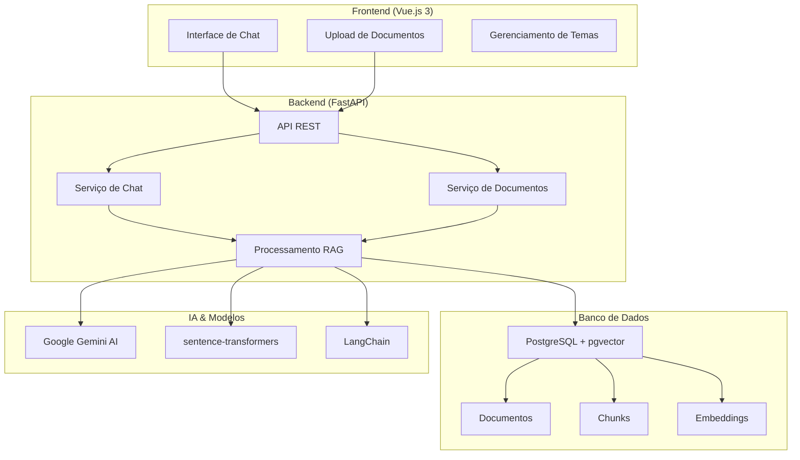

# RAGBot - Sistema Inteligente de Chat


---

## 🚀 Visão Geral

O **RAGBot** é um sistema completo de chat inteligente desenvolvido como Trabalho de Conclusão de Curso (TCC) em Engenharia de Software. Utiliza a técnica **RAG (Retrieval-Augmented Generation)** para fornecer respostas precisas e contextualmente relevantes baseadas **exclusivamente** em documentos PDF carregados no sistema.

!!! abstract "O que é RAG?"
    **Retrieval-Augmented Generation** é uma técnica de IA que combina:
    
    - 🔍 **Busca semântica** em uma base de conhecimento específica
    - 🧠 **Geração de linguagem natural** com modelos LLM
    - ⚡ **Respostas contextualmente precisas** baseadas apenas nos documentos fornecidos

## ✨ Funcionalidades Principais

### 📄 Processamento Inteligente de Documentos
- **Ingestão automática** de arquivos PDF
- **Chunking inteligente** do conteúdo para otimizar a busca
- **Geração de embeddings** vetoriais usando sentence-transformers
- **Armazenamento eficiente** em PostgreSQL com pgvector

### 💬 Chat Contextual Avançado
- **Interface estilo ChatGPT** moderna e responsiva
- **Busca semântica** nos documentos carregados
- **Respostas precisas** usando Google Gemini AI
- **Modo claro/escuro** com persistência de preferências

### 🔒 Segurança e Confiabilidade
- **Respostas baseadas apenas** no conteúdo dos documentos
- **Não inventa informações** não presentes nos documentos
- **Transparência total** sobre as fontes utilizadas
- **API RESTful** com validação rigorosa

## 🏗️ Arquitetura do Sistema



## 📊 Stack Tecnológica Completa

=== "Backend"
    
    | Tecnologia | Versão | Propósito |
    |------------|--------|-----------|
    | **Python** | 3.11+ | Linguagem principal |
    | **FastAPI** | 0.115+ | Framework web moderno |
    | **LangChain** | 0.3.7 | Orquestração de IA |
    | **Pydantic** | 2.10+ | Validação de dados |
    | **PostgreSQL** | 15+ | Banco de dados |
    | **pgvector** | 0.3.6 | Operações vetoriais |

=== "Frontend"

    | Tecnologia | Versão | Propósito |
    |------------|--------|-----------|
    | **Vue.js** | 3.5+ | Framework reativo |
    | **TypeScript** | 5.9+ | JavaScript tipado |
    | **Vite** | 7.1+ | Build tool moderna |
    | **Tailwind CSS** | 3.4+ | Framework de CSS |
    | **Pinia** | 3.0+ | Gerenciamento de estado |
    | **Marked** | 16.3+ | Renderização Markdown |

=== "IA & Modelos"

    | Tecnologia | Versão | Propósito |
    |------------|--------|-----------|
    | **Google Gemini** | API v1 | Modelo de linguagem |
    | **sentence-transformers** | 3.3.1 | Geração de embeddings |
    | **all-MiniLM-L6-v2** | - | Modelo de embeddings |
    | **pypdf** | 5.1.0 | Processamento de PDF |

## 🎯 Casos de Uso

### 🏢 Organizações
- **Consulta de políticas** internas e documentos corporativos
- **Base de conhecimento** para equipes de suporte
- **Automatização de FAQ** baseada em manuais

### 🎓 Instituições Educacionais
- **Consulta de regulamentos** e normas acadêmicas
- **Suporte estudantil** automatizado
- **Pesquisa em documentos** institucionais

### 📚 Pesquisa e Desenvolvimento
- **Análise de documentos** técnicos e científicos
- **Extração de informações** específicas
- **Síntese inteligente** de conteúdo

## 🚀 Quick Start

### 1. Clone os Repositórios
```bash
# Backend
git clone https://github.com/TCC-RagBot/RagBot-Back.git
cd RagBot-Back

# Frontend (em outro terminal)
git clone https://github.com/TCC-RagBot/RagBot-Front.git
cd RagBot-Front
```

### 2. Configure o Backend
```bash
cd RagBot-Back
python -m venv venv
.\venv\Scripts\Activate.ps1  # Windows
pip install -r requirements.txt
docker-compose up -d  # PostgreSQL
python -m app.main    # Inicia API
```

### 3. Configure o Frontend
```bash
cd RagBot-Front
npm install
npm run dev  # Inicia interface
```

### 4. Acesse o Sistema
- **Frontend**: http://localhost:5173
- **API Docs**: http://localhost:8000/docs
- **Health Check**: http://localhost:8000/health

!!! tip "Próximos Passos"
    1. 📖 Leia o [Setup Detalhado](desenvolvimento/setup.md) para configuração completa
    2. 🏗️ Explore a [Arquitetura](engenharia/arquitetura.md) do sistema
    3. 🔧 Consulte a [API Reference](desenvolvimento/api.md) para integração
    4. 📋 Veja os [Requisitos](engenharia/requisitos.md) funcionais

## 🎓 Contexto Acadêmico

Este projeto foi desenvolvido como **Trabalho de Conclusão de Curso** no curso de **Engenharia de Software**, demonstrando competências em:

- ✅ **Arquitetura de Software** moderna e escalável
- ✅ **Metodologias Ágeis** com Scrum e Kanban  
- ✅ **Inteligência Artificial** aplicada com RAG
- ✅ **DevOps e CI/CD** com Docker e GitHub Actions
- ✅ **Engenharia de Requisitos** e modelagem UML
- ✅ **Qualidade de Software** com testes automatizados

---

!!! success "Sistema em Produção"
    O RAGBot está **totalmente funcional** e pronto para uso. Consulte a documentação completa para implementar em seu ambiente.

**Desenvolvido por:** Equipe RAGBot | **Curso:** Engenharia de Software | **Ano:** 2025