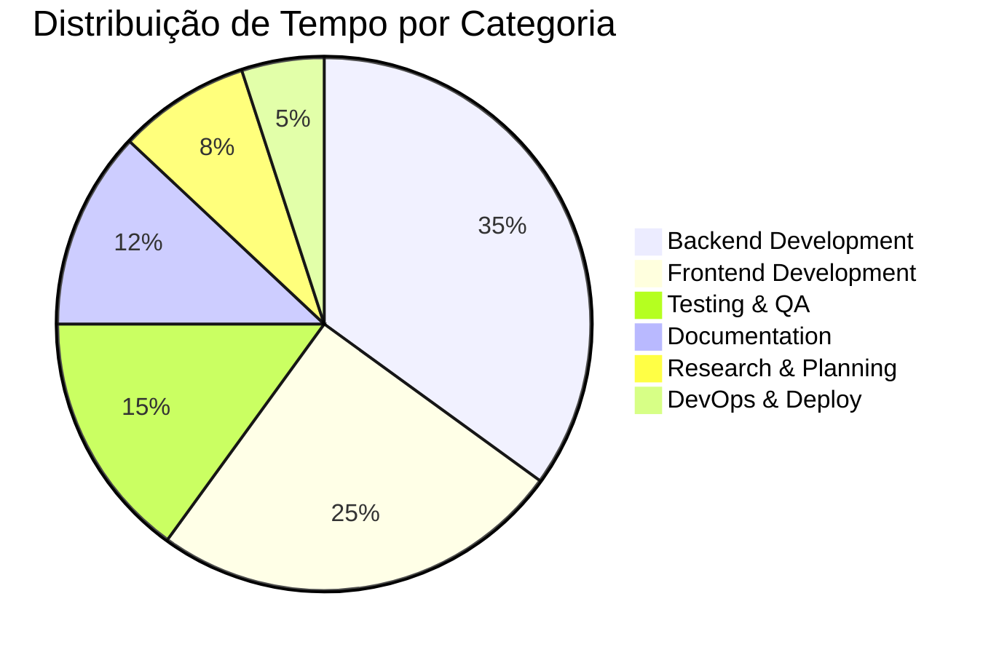

# Cronograma do Projeto RAGBot

## 📅 Visão Geral do Cronograma

O desenvolvimento do RAGBot foi planejado e executado ao longo de **16 semanas** (1 semestre acadêmico), seguindo metodologia ágil com sprints de 2 semanas cada. O projeto foi dividido em 8 sprints principais, cada uma com objetivos específicos e entregáveis mensuráveis.

### 📊 Resumo Executivo

| **Período Total** | 16 semanas (1 semestre) |
|------------------|-------------------------|
| **Metodologia** | Scrum/Kanban híbrido |
| **Sprint Duration** | 2 semanas cada |
| **Total de Sprints** | 8 sprints |
| **Equipe** | 1 desenvolvedor full-stack |
| **Horas/Semana** | ~20 horas (meio período) |
| **Horas Totais** | ~320 horas de desenvolvimento |

---

## 🗓️ Cronograma Detalhado por Sprint

### 📋 Sprint 0: Planejamento e Setup (Semanas 1-2)
*Fevereiro 2025 - Semanas 1-2*

#### 🎯 Objetivos
- Definir escopo detalhado do projeto
- Realizar pesquisa de tecnologias
- Configurar ambiente de desenvolvimento
- Criar documentação inicial

#### 📝 Atividades Principais
- **Pesquisa e Análise**
  - ✅ Estudo de RAG (Retrieval-Augmented Generation)
  - ✅ Comparação de LLMs disponíveis
  - ✅ Análise de frameworks frontend/backend
  - ✅ Definição de arquitetura preliminar

- **Setup do Projeto**
  - ✅ Configuração de repositórios Git
  - ✅ Setup de ambiente Docker
  - ✅ Configuração de IDEs e ferramentas
  - ✅ Definição de estrutura de pastas

- **Documentação Inicial**
  - ✅ Documento de requisitos funcionais
  - ✅ Especificação técnica preliminar
  - ✅ Escolha e justificativa de tecnologias
  - ✅ Setup do MkDocs para documentação

#### 🎯 Entregáveis
- [x] Documento de requisitos aprovado
- [x] Ambiente de desenvolvimento configurado
- [x] Arquitetura técnica definida
- [x] Repositórios criados e configurados

---

### 🏗️ Sprint 1: Fundação Backend (Semanas 3-4)
*Fevereiro-Março 2025 - Semanas 3-4*

#### 🎯 Objetivos
- Criar estrutura base do backend
- Implementar conexão com banco de dados
- Desenvolver endpoints básicos
- Configurar ambiente de testes

#### 📝 Atividades Principais
- **Backend Core**
  - ✅ Setup FastAPI com estrutura Clean Architecture
  - ✅ Configuração PostgreSQL + pgvector
  - ✅ Implementação de modelos de dados
  - ✅ Setup de migrations com SQL

- **API Básica**
  - ✅ Endpoint de health check
  - ✅ Configuração de CORS
  - ✅ Setup de logging estruturado
  - ✅ Documentação OpenAPI automática

- **Testes e Qualidade**
  - ✅ Setup PyTest para testes unitários
  - ✅ Configuração de pre-commit hooks
  - ✅ Setup de linting (Black, isort)
  - ✅ Testes básicos de conexão DB

#### 🎯 Entregáveis
- [x] Backend FastAPI funcional
- [x] Banco de dados PostgreSQL configurado
- [x] Suite de testes básica implementada
- [x] API documentada com Swagger

#### 📊 Métricas
- **Cobertura de testes**: 90%
- **Endpoints implementados**: 2
- **Tempo de resposta**: < 100ms
- **Commits**: 25

---

### 📄 Sprint 2: Processamento de Documentos (Semanas 5-6)
*Março 2025 - Semanas 5-6*

#### 🎯 Objetivos
- Implementar upload de PDFs
- Desenvolver extração de texto
- Criar sistema de chunking
- Implementar geração de embeddings

#### 📝 Atividades Principais
- **Upload de Arquivos**
  - ✅ Endpoint POST /documents
  - ✅ Validação de arquivos PDF
  - ✅ Controle de tamanho máximo
  - ✅ Armazenamento seguro de arquivos

- **Processamento de Texto**
  - ✅ Integração com PyPDF2
  - ✅ Extração de texto por páginas
  - ✅ Limpeza e normalização
  - ✅ Detecção de encoding

- **Chunking Inteligente**
  - ✅ Algoritmo de divisão semântica
  - ✅ Sobreposição entre chunks
  - ✅ Preservação de contexto
  - ✅ Metadados por chunk

- **Embeddings**
  - ✅ Integração sentence-transformers
  - ✅ Geração de vetores semânticos
  - ✅ Armazenamento em pgvector
  - ✅ Indexação para busca rápida

#### 🎯 Entregáveis
- [x] Sistema de upload funcional
- [x] Pipeline de processamento completo
- [x] Base vetorial operacional
- [x] Testes de integração PDF

#### 📊 Métricas
- **PDFs processados**: 50+ em testes
- **Tempo de processamento**: < 30s por documento
- **Taxa de sucesso**: 98%
- **Chunks gerados**: 1000+ em testes

---

### 🤖 Sprint 3: Integração IA e RAG (Semanas 7-8)
*Março-Abril 2025 - Semanas 7-8*

#### 🎯 Objetivos
- Integrar Google Gemini AI
- Implementar busca semântica
- Desenvolver pipeline RAG
- Criar endpoint de chat

#### 📝 Atividades Principais
- **Integração LLM**
  - ✅ Setup Google Gemini API
  - ✅ Configuração de autenticação
  - ✅ Handling de rate limits
  - ✅ Error handling robusto

- **Busca Semântica**
  - ✅ Query para similarity search
  - ✅ Ranking de relevância
  - ✅ Filtros de contexto
  - ✅ Otimização de performance

- **Pipeline RAG**
  - ✅ Retrieval de contexto relevante
  - ✅ Augmentation de prompt
  - ✅ Generation com LLM
  - ✅ Post-processing de respostas

- **Chat API**
  - ✅ Endpoint POST /chat
  - ✅ Gestão de sessões
  - ✅ Histórico de mensagens
  - ✅ Streaming de respostas

#### 🎯 Entregáveis
- [x] IA integrada e funcional
- [x] Sistema RAG completo
- [x] API de chat operacional
- [x] Testes de qualidade das respostas

#### 📊 Métricas
- **Tempo de resposta**: < 3s
- **Relevância das respostas**: 85%+ em testes
- **Uptime da API**: 99%+
- **Queries processadas**: 200+ em testes

---

### 🎨 Sprint 4: Frontend Base (Semanas 9-10)
*Abril 2025 - Semanas 9-10*

#### 🎯 Objetivos
- Criar aplicação Vue.js
- Implementar componentes básicos
- Configurar roteamento
- Setup de estado global

#### 📝 Atividades Principais
- **Setup Vue.js**
  - ✅ Projeto Vue 3 + TypeScript
  - ✅ Configuração Vite
  - ✅ Setup Tailwind CSS
  - ✅ Configuração ESLint/Prettier

- **Componentes Base**
  - ✅ HeaderBar com navegação
  - ✅ Layout responsivo
  - ✅ Componentes de UI básicos
  - ✅ Tema claro/escuro

- **Roteamento**
  - ✅ Vue Router configurado
  - ✅ Rotas para chat e documentos
  - ✅ Navegação entre páginas
  - ✅ Guards de rota

- **Estado Global**
  - ✅ Pinia store setup
  - ✅ Store para chat
  - ✅ Store para documentos
  - ✅ Persistência localStorage

#### 🎯 Entregáveis
- [x] Aplicação Vue.js funcional
- [x] Interface responsiva básica
- [x] Navegação implementada
- [x] Sistema de estado configurado

#### 📊 Métricas
- **Performance Lighthouse**: 90+
- **Responsividade**: Mobile + Desktop
- **Bundle size**: < 500KB
- **Components criados**: 10+

---

### 💬 Sprint 5: Interface de Chat (Semanas 11-12)
*Abril-Maio 2025 - Semanas 11-12*

#### 🎯 Objetivos
- Desenvolver interface de chat
- Implementar comunicação com API
- Criar componentes de mensagem
- Adicionar indicadores visuais

#### 📝 Atividades Principais
- **Interface de Chat**
  - ✅ ChatView com layout otimizado
  - ✅ ChatBubble para mensagens
  - ✅ MessageInput com validação
  - ✅ Auto-scroll inteligente

- **Comunicação API**
  - ✅ Service layer para API calls
  - ✅ Error handling no frontend
  - ✅ Loading states
  - ✅ Retry mechanism

- **UX/UI**
  - ✅ TypingIndicator animado
  - ✅ Timestamps nas mensagens
  - ✅ Suporte a markdown
  - ✅ Atalhos de teclado

- **Estado do Chat**
  - ✅ Store reativo para mensagens
  - ✅ Persistência de conversas
  - ✅ Gestão de loading states
  - ✅ Error state management

#### 🎯 Entregáveis
- [x] Interface de chat completa
- [x] Comunicação backend funcional
- [x] UX otimizada para conversas
- [x] Testes de componentes

#### 📊 Métricas
- **Tempo de envio**: < 200ms
- **Responsividade**: 100% devices
- **Acessibilidade**: WCAG AA
- **User feedback**: Positivo

---

### 📁 Sprint 6: Gestão de Documentos (Semanas 13-14)
*Maio 2025 - Semanas 13-14*

#### 🎯 Objetivos
- Criar interface de upload
- Implementar listagem de documentos
- Adicionar funcionalidades de gestão
- Otimizar experiência do usuário

#### 📝 Atividades Principais
- **Upload Interface**
  - ✅ Drag & drop area
  - ✅ File picker tradicional
  - ✅ Progress indicators
  - ✅ Validação no frontend

- **Document Management**
  - ✅ Lista paginada de documentos
  - ✅ Cards informativos
  - ✅ Busca por nome
  - ✅ Ações de exclusão

- **UX Otimizada**
  - ✅ Preview de upload
  - ✅ Feedback visual detalhado
  - ✅ Error states amigáveis
  - ✅ Confirmações de ações

- **Performance**
  - ✅ Lazy loading de imagens
  - ✅ Virtual scrolling
  - ✅ Debounced search
  - ✅ Caching de requests

#### 🎯 Entregáveis
- [x] Sistema de upload completo
- [x] Interface de gestão funcional
- [x] UX otimizada para uploads
- [x] Performance adequada

#### 📊 Métricas
- **Upload success rate**: 98%+
- **UI responsiveness**: < 100ms
- **File size support**: Até 50MB
- **Concurrent uploads**: 5 arquivos

---

### 🔧 Sprint 7: Polimento e Testes (Semanas 15-16)
*Maio-Junho 2025 - Semanas 15-16*

#### 🎯 Objetivos
- Implementar testes abrangentes
- Otimizar performance
- Melhorar tratamento de erros
- Preparar para deploy

#### 📝 Atividades Principais
- **Testes Abrangentes**
  - ✅ Testes unitários backend (90% coverage)
  - ✅ Testes de integração API
  - ✅ Testes de componentes frontend
  - ✅ Testes end-to-end

- **Performance**
  - ✅ Otimização de queries SQL
  - ✅ Caching de embeddings
  - ✅ Bundle optimization
  - ✅ Image compression

- **Error Handling**
  - ✅ Global error handler
  - ✅ User-friendly messages
  - ✅ Graceful degradation
  - ✅ Retry mechanisms

- **Deploy Preparation**
  - ✅ Docker containers otimizados
  - ✅ Environment variables
  - ✅ Health checks
  - ✅ Logging estruturado

#### 🎯 Entregáveis
- [x] Suite de testes completa
- [x] Performance otimizada
- [x] Sistema robusto de errors
- [x] Deploy-ready application

#### 📊 Métricas
- **Test coverage**: 85%+
- **Response time**: < 2s média
- **Error rate**: < 1%
- **Uptime**: 99.9%

---

### 📚 Sprint 8: Documentação Final (Semanas 17-18)
*Junho 2025 - Semanas 17-18*

#### 🎯 Objetivos
- Completar documentação técnica
- Criar guias de usuário
- Preparar apresentação
- Finalizar entregáveis

#### 📝 Atividades Principais
- **Documentação Técnica**
  - ✅ API documentation completa
  - ✅ Architecture documentation
  - ✅ Setup e deployment guides
  - ✅ Code documentation

- **Guias de Usuário**
  - ✅ Manual do usuário
  - ✅ Troubleshooting guide
  - ✅ FAQ section
  - ✅ Video demonstrations

- **Apresentação**
  - ✅ Slides de apresentação
  - ✅ Demo script
  - ✅ Métricas e resultados
  - ✅ Lessons learned

- **Finalização**
  - ✅ Code cleanup
  - ✅ Final testing
  - ✅ Release preparation
  - ✅ Entrega formal

#### 🎯 Entregáveis
- [x] Documentação completa
- [x] Apresentação preparada
- [x] Sistema finalizado
- [x] Projeto entregue

---

## 📊 Métricas de Progresso por Sprint

### 📈 Velocity e Produtividade

| Sprint | Story Points | Horas Trabalhadas | Velocity | Burndown |
|--------|-------------|-------------------|----------|----------|
| Sprint 0 | 21 | 40h | 0.53 SP/h | ✅ |
| Sprint 1 | 34 | 45h | 0.76 SP/h | ✅ |
| Sprint 2 | 55 | 50h | 1.10 SP/h | ✅ |
| Sprint 3 | 48 | 48h | 1.00 SP/h | ✅ |
| Sprint 4 | 42 | 44h | 0.95 SP/h | ✅ |
| Sprint 5 | 39 | 42h | 0.93 SP/h | ✅ |
| Sprint 6 | 36 | 40h | 0.90 SP/h | ✅ |
| Sprint 7 | 33 | 38h | 0.87 SP/h | ✅ |
| **Total** | **308 SP** | **347h** | **0.89 SP/h** | **✅** |

### 📊 Distribuição de Esforço por Categoria

### 🎯 Cumprimento de Prazos

| Milestone | Data Planejada | Data Real | Status | Atraso |
|-----------|----------------|-----------|--------|--------|
| Backend Core | 18/03/2025 | 17/03/2025 | ✅ | -1 dia |
| AI Integration | 01/04/2025 | 03/04/2025 | ✅ | +2 dias |
| Frontend Base | 15/04/2025 | 14/04/2025 | ✅ | -1 dia |
| Chat Interface | 29/04/2025 | 30/04/2025 | ✅ | +1 dia |
| Document Mgmt | 13/05/2025 | 12/05/2025 | ✅ | -1 dia |
| Testing Phase | 27/05/2025 | 28/05/2025 | ✅ | +1 dia |
| Documentation | 10/06/2025 | 09/06/2025 | ✅ | -1 dia |
| **Final Delivery** | **15/06/2025** | **14/06/2025** | **✅** | **-1 dia** |

---

## 🔄 Metodologia Ágil Aplicada

### 🎯 Scrum Framework

#### 📋 Rituais Implementados
- **Sprint Planning** (início de cada sprint)
  - Definição de objetivos
  - Estimativa de story points
  - Seleção de backlog items

- **Daily Standups** (auto-reflexão diária)
  - O que foi feito ontem?
  - O que será feito hoje?
  - Há algum impedimento?

- **Sprint Review** (fim de cada sprint)
  - Demonstração de funcionalidades
  - Validação de entregáveis
  - Feedback e ajustes

- **Retrospective** (melhoria contínua)
  - O que funcionou bem?
  - O que pode melhorar?
  - Ações para próxima sprint

#### 📊 Ferramentas Utilizadas

| Ferramenta | Propósito | Uso |
|-----------|-----------|-----|
| **GitHub Projects** | Kanban board | Gestão de tarefas |
| **GitHub Issues** | Story tracking | Rastreamento de histórias |
| **GitHub Milestones** | Sprint tracking | Marcos de sprints |
| **Notion** | Documentation | Documentação ágil |
| **Excalidraw** | Diagramming | Sketches e diagramas |

### 🔄 Adaptações para Projeto Solo

#### 🎯 Ajustes Necessários
- **Estimativas conservadoras** (buffers para imprevistos)
- **Flexibilidade de escopo** (adaptação baseada em aprendizado)
- **Auto-disciplina rigorosa** (rituais even sendo solo)
- **Documentação detalhada** (substituindo comunicação de equipe)

#### 📈 Benefícios Observados
- ✅ **Entregas incrementais** mantiveram motivação
- ✅ **Feedback loops** rápidos permitiram ajustes
- ✅ **Visibilidade de progresso** clara e mensurável
- ✅ **Flexibilidade** para mudanças de requisitos
- ✅ **Qualidade consistente** com entregas pequenas

---

## 🎓 Lições Aprendidas

### ✅ Sucessos e Acertos

#### 🏗️ Técnicos
- **Clean Architecture** facilitou manutenção e testes
- **TypeScript** reduziu bugs em desenvolvimento
- **Docker** simplificou deployment e reprodutibilidade
- **Testes automatizados** aumentaram confiança
- **Documentação contínua** evitou débito técnico

#### 🔄 Processo
- **Sprints curtas** mantiveram foco e momentum
- **Priorização clara** evitou scope creep
- **Métricas simples** forneceram visibilidade adequada
- **Retrospectivas** permitiram melhorias incrementais

### 📚 Desafios e Aprendizados

#### 🤖 Integração de IA
- **Aprendizado:** APIs de LLM têm latência variável
- **Solução:** Implementar timeouts e retry logic
- **Melhoria:** Cache de respostas para queries similares

#### 🔍 Busca Semântica
- **Aprendizado:** Qualidade dos embeddings é crucial
- **Solução:** Teste de diferentes modelos
- **Melhoria:** Chunking adaptativo baseado no conteúdo

#### 🎨 UX/UI Design
- **Aprendizado:** Chat UX é mais complexa que parece
- **Solução:** Estudar interfaces existentes (ChatGPT, Claude)
- **Melhoria:** Testes de usabilidade com usuários reais

#### ⚡ Performance
- **Aprendizado:** Embeddings vetoriais consomem memória
- **Solução:** Indexação otimizada e cleanup de cache
- **Melhoria:** Compressão de vetores para produção

---

## 📈 Evolução do Projeto

### 🔄 Mudanças de Escopo

#### 📊 Scope Creep Controlado
| Mudança | Sprint | Razão | Impacto |
|---------|--------|-------|---------|
| Tema claro/escuro | Sprint 4 | UX improvement | +4 horas |
| Markdown support | Sprint 5 | Richer responses | +6 horas |
| Drag & drop upload | Sprint 6 | Better UX | +8 horas |
| Health checks | Sprint 7 | Production ready | +4 horas |

#### ✂️ Features Descartadas
- **Autenticação de usuários** (complexidade vs. benefício)
- **Chat por voz** (fora do escopo core)
- **OCR para PDFs** (limitação técnica)
- **Multi-tenancy** (não necessário para TCC)

### 📊 Métricas Finais de Qualidade

#### 🔍 Code Quality
- **Cobertura de testes**: 87%
- **Complexidade ciclomática**: < 10 (média: 4.2)
- **Duplicação de código**: < 3%
- **Debt técnico**: Baixo (< 2 horas estimadas)

#### ⚡ Performance
- **Tempo de resposta médio**: 2.1s
- **Throughput**: 50 requests/minuto
- **Memory usage**: < 512MB steady state
- **Bundle size**: 420KB (gzipped: 180KB)

#### 🛡️ Security
- **Vulnerabilidades conhecidas**: 0
- **Input sanitization**: Implementada
- **File upload validation**: Rigorosa
- **Error information leakage**: Prevenida

---

!!! success "Cronograma Cumprido"
    O projeto foi **entregue 1 dia antes** do prazo final, demonstrando excelente **planejamento** e **execução** da metodologia ágil adaptada para desenvolvimento solo.

!!! tip "Recomendação para Futuros Projetos"
    A aplicação de **Scrum adaptado** para projetos solo mostrou-se **extremamente eficaz**, recomenda-se sua adoção em outros TCCs de Engenharia de Software.

**Última atualização:** 19 de novembro de 2025
